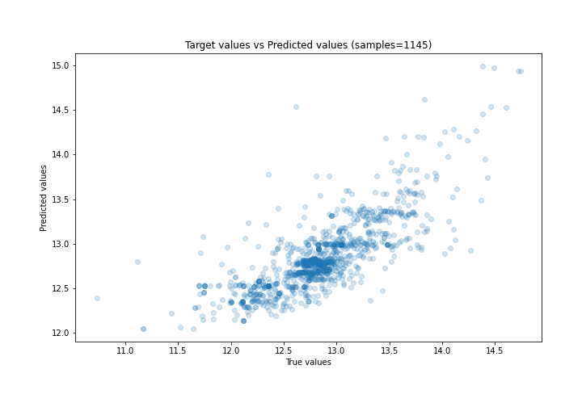

# Summary of 3_Linear

[<< Go back](../README.md)

## Linear Regression (Linear)
- **n_jobs**: -1
- **explain_level**: 2

## Validation
 - **validation_type**: split
 - **train_ratio**: 0.75
 - **shuffle**: True

## Optimized metric
rmse

## Training time

3.8 seconds

### Metric details:
| Metric   |     Score |
|:---------|----------:|
| MAE      | 0.21812   |
| MSE      | 0.0964732 |
| RMSE     | 0.310601  |
| R2       | 0.612556  |
| MAPE     | 0.0170603 |

## Learning curves

## Coefficients
| feature                   |   Learner_1 |
|:--------------------------|------------:|
| Neighbourhood             |  0.63891    |
| DistancePark              |  0.317638   |
| Eircode                   |  0.20012    |
| intercept                 |  0.150934   |
| Year                      |  0.0749246  |
| Longitude                 |  0.0556341  |
| Month                     |  0.00188969 |
| Property Size Description | -0.00331157 |
| DistanceSchool            | -0.0178914  |
| DistanceSecSchool         | -0.0291508  |
| Latitude                  | -0.0374394  |
| Town                      | -0.047479   |
| Apartment                 | -0.219676   |
| DistanceIFSC              | -0.233283   |
| UsedProperty              | -0.265213   |

## Permutation-based Importance

## True vs Predicted

## Predicted vs Residuals

## SHAP Importance

## SHAP Dependence plots

### Dependence (Fold 1)

## SHAP Decision plots

### Top-10 Worst decisions (Fold 1)

### Top-10 Best decisions (Fold 1)

[<< Go back](../README.md)
