# Exploratory Data Analysis

[<< Go back](../README.md)
## Feature : target
- **Feature type** : continous
- **Missing** : 0.0%
- **Unique** : 3178
- **Count** :4578.0
- **Mean** :12.842537928337654
- **Std** :0.49535512432333384
- **Min** :10.551630044962797
- **25%th Percentile** : 12.605366651495657
- **50%th Percentile** : 12.837216115218604
- **75%th Percentile** : 13.056979934087188
- **Max** :14.811411987901558

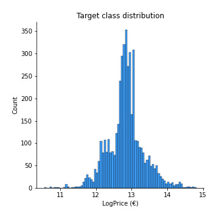
## Feature : UsedProperty
- **Feature type** : discrete
- **Missing** : 0.0%
- **Unique** : 2
- **Count** :4578.0
- **Mean** :0.4563128003494976
- **Std** :0.49814218103434366
- **Min** :0.0
- **25%th Percentile** : 0.0
- **50%th Percentile** : 0.0
- **75%th Percentile** : 1.0
- **Max** :1.0

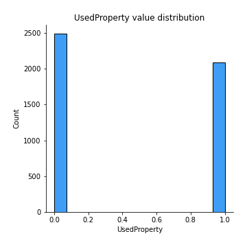
## Feature : Property Size Description
- **Feature type** : discrete
- **Missing** : 0.0%
- **Unique** : 3
- **Count** :4578.0
- **Mean** :1.2424639580602883
- **Std** :0.5448760277671948
- **Min** :0.0
- **25%th Percentile** : 1.0
- **50%th Percentile** : 1.0
- **75%th Percentile** : 2.0
- **Max** :2.0

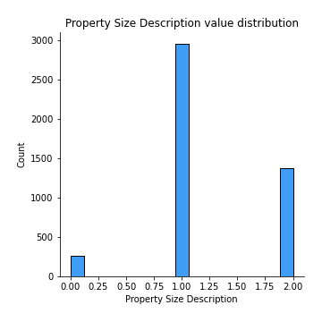
## Feature : Year
- **Feature type** : discrete
- **Missing** : 0.0%
- **Unique** : 8
- **Count** :4578.0
- **Mean** :2017.3759283529926
- **Std** :2.3586094461913425
- **Min** :2014.0
- **25%th Percentile** : 2015.0
- **50%th Percentile** : 2018.0
- **75%th Percentile** : 2019.0
- **Max** :2021.0

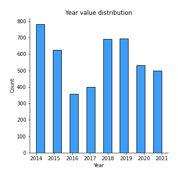
## Feature : Month
- **Feature type** : discrete
- **Missing** : 0.0%
- **Unique** : 12
- **Count** :4578.0
- **Mean** :7.3414154652686765
- **Std** :3.4880916560933306
- **Min** :1.0
- **25%th Percentile** : 4.0
- **50%th Percentile** : 8.0
- **75%th Percentile** : 10.0
- **Max** :12.0

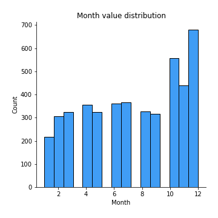
## Feature : Town
- **Feature type** : continous
- **Missing** : 0.0%
- **Unique** : 24
- **Count** :4578.0
- **Mean** :431722.6442641222
- **Std** :179321.02071667227
- **Min** :207913.35539568344
- **25%th Percentile** : 329388.58701886795
- **50%th Percentile** : 368081.2613761468
- **75%th Percentile** : 460854.4194939271
- **Max** :1137529.2432432433

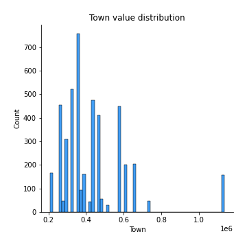
## Feature : Apartment
- **Feature type** : discrete
- **Missing** : 0.0%
- **Unique** : 2
- **Count** :4578.0
- **Mean** :0.127129750982962
- **Std** :0.3331546518527147
- **Min** :0.0
- **25%th Percentile** : 0.0
- **50%th Percentile** : 0.0
- **75%th Percentile** : 0.0
- **Max** :1.0

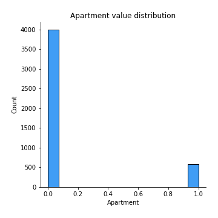
## Feature : Neighbourhood
- **Feature type** : continous
- **Missing** : 0.0%
- **Unique** : 409
- **Count** :4578.0
- **Mean** :428402.74508519005
- **Std** :206362.29215898944
- **Min** :107233.0
- **25%th Percentile** : 322868.0
- **50%th Percentile** : 379563.0
- **75%th Percentile** : 467092.0
- **Max** :1774756.0

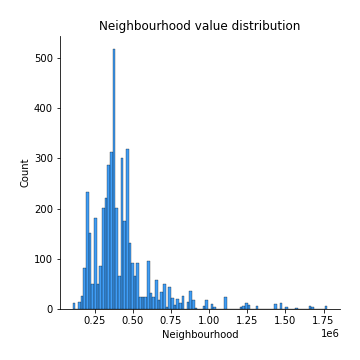
## Feature : Eircode
- **Feature type** : continous
- **Missing** : 0.0%
- **Unique** : 16
- **Count** :4578.0
- **Mean** :432272.8781902596
- **Std** :151314.59573683582
- **Min** :207913.35539568344
- **25%th Percentile** : 333925.60328253225
- **50%th Percentile** : 406163.22153846157
- **75%th Percentile** : 460854.4194939271
- **Max** :794885.1730962343

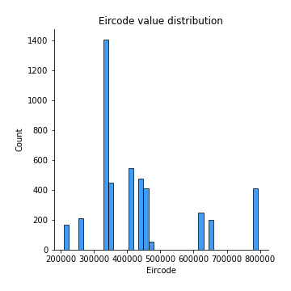
## Feature : Latitude
- **Feature type** : continous
- **Missing** : 0.0%
- **Unique** : 922
- **Count** :4578.0
- **Mean** :53.35386579068867
- **Std** :0.06814898753810267
- **Min** :53.2435623
- **25%th Percentile** : 53.2871703
- **50%th Percentile** : 53.3472378
- **75%th Percentile** : 53.403394000000006
- **Max** :53.496674

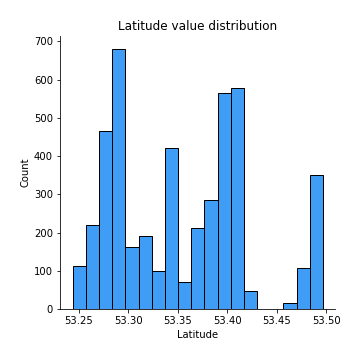
## Feature : Longitude
- **Feature type** : continous
- **Missing** : 0.0%
- **Unique** : 922
- **Count** :4578.0
- **Mean** :-6.264548100414783
- **Std** :0.1104351904303828
- **Min** :-6.4746232
- **25%th Percentile** : -6.3547682
- **50%th Percentile** : -6.2441539124013605
- **75%th Percentile** : -6.1579728032953325
- **Max** :-6.1064329844499134

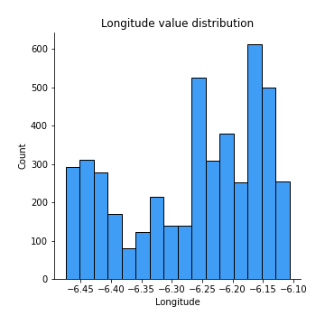
## Feature : DistanceIFSC
- **Feature type** : continous
- **Missing** : 0.0%
- **Unique** : 922
- **Count** :4578.0
- **Mean** :9.834578436577125
- **Std** :4.026323218344404
- **Min** :0.9334758836962448
- **25%th Percentile** : 6.924246919213535
- **50%th Percentile** : 8.626190465819109
- **75%th Percentile** : 13.53359192141441
- **Max** :18.48705658280745

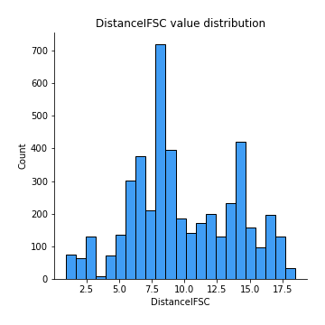
## Feature : DistanceSchool
- **Feature type** : continous
- **Missing** : 0.0%
- **Unique** : 922
- **Count** :4578.0
- **Mean** :0.6444506025538898
- **Std** :0.3357426241451573
- **Min** :0.0318512440228353
- **25%th Percentile** : 0.385852378067478
- **50%th Percentile** : 0.649884344300563
- **75%th Percentile** : 0.7935152355809898
- **Max** :2.605576624109076

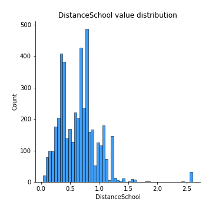
## Feature : DistancePark
- **Feature type** : continous
- **Missing** : 0.0%
- **Unique** : 921
- **Count** :4578.0
- **Mean** :3.3473334673275756
- **Std** :2.984173046890224
- **Min** :0.0
- **25%th Percentile** : 0.7089455420951307
- **50%th Percentile** : 2.278945269712843
- **75%th Percentile** : 5.971884298572058
- **Max** :10.479233194327191

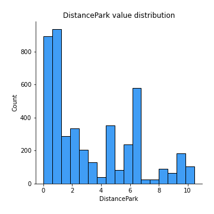
## Feature : DistanceSecSchool
- **Feature type** : continous
- **Missing** : 0.0%
- **Unique** : 914
- **Count** :4578.0
- **Mean** :1.0054242618421303
- **Std** :0.7597738506115618
- **Min** :0.0
- **25%th Percentile** : 0.4380964451439011
- **50%th Percentile** : 0.7420125971800704
- **75%th Percentile** : 1.477684469317993
- **Max** :3.532329838016618

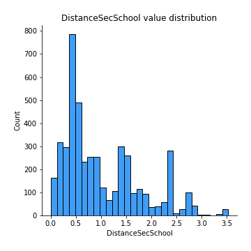

[<< Go back](../README.md)
