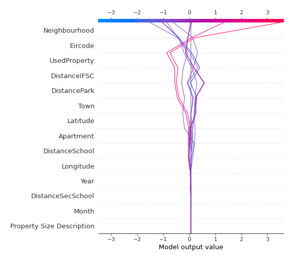

# Summary of 3_Linear

[<< Go back](../README.md)

## Linear Regression (Linear)
- **n_jobs**: -1
- **explain_level**: 2

## Validation
 - **validation_type**: split
 - **train_ratio**: 0.75
 - **shuffle**: True

## Optimized metric
rmse

## Training time

4.2 seconds

### Metric details:
| Metric   |     Score |
|:---------|----------:|
| MAE      | 0.168791  |
| MSE      | 0.0674894 |
| RMSE     | 0.259787  |
| R2       | 0.647989  |
| MAPE     | 0.0133179 |

## Learning curves

## Coefficients
| feature                   |   Learner_1 |
|:--------------------------|------------:|
| Neighbourhood             |  0.598244   |
| Eircode                   |  0.358429   |
| DistancePark              |  0.19345    |
| intercept                 |  0.176498   |
| Latitude                  |  0.104667   |
| Year                      |  0.0155755  |
| DistanceSecSchool         |  0.0109935  |
| Property Size Description |  0.00103967 |
| Month                     | -0.0050665  |
| Longitude                 | -0.0540689  |
| DistanceSchool            | -0.0562524  |
| Town                      | -0.0734525  |
| DistanceIFSC              | -0.276712   |
| Apartment                 | -0.387116   |
| UsedProperty              | -0.475029   |

## Permutation-based Importance

## True vs Predicted

## Predicted vs Residuals

## SHAP Importance

## SHAP Dependence plots

### Dependence (Fold 1)

## SHAP Decision plots

### Top-10 Worst decisions (Fold 1)

### Top-10 Best decisions (Fold 1)

[<< Go back](../README.md)
