# Exploratory Data Analysis

[<< Go back](../README.md)
## Feature : target
- **Feature type** : continous
- **Missing** : 0.0%
- **Unique** : 1619
- **Count** :2226.0
- **Mean** :12.854521286342765
- **Std** :0.4212160550926819
- **Min** :10.551630044962797
- **25%th Percentile** : 12.676638772794233
- **50%th Percentile** : 12.827299283559075
- **75%th Percentile** : 13.016104148166715
- **Max** :14.458364480775408

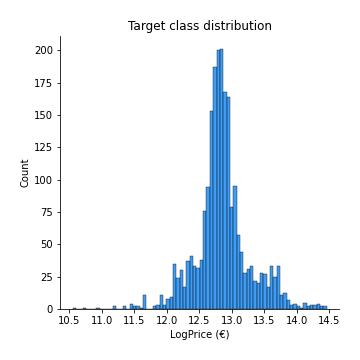
## Feature : UsedProperty
- **Feature type** : discrete
- **Missing** : 0.0%
- **Unique** : 2
- **Count** :2226.0
- **Mean** :0.33917340521114103
- **Std** :0.47353515302781796
- **Min** :0.0
- **25%th Percentile** : 0.0
- **50%th Percentile** : 0.0
- **75%th Percentile** : 1.0
- **Max** :1.0

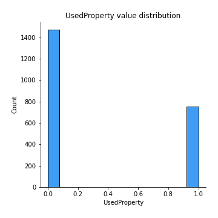
## Feature : Property Size Description
- **Feature type** : discrete
- **Missing** : 0.0%
- **Unique** : 3
- **Count** :2226.0
- **Mean** :1.2443845462713388
- **Std** :0.5266194100761397
- **Min** :0.0
- **25%th Percentile** : 1.0
- **50%th Percentile** : 1.0
- **75%th Percentile** : 2.0
- **Max** :2.0

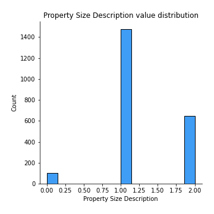
## Feature : Year
- **Feature type** : discrete
- **Missing** : 0.0%
- **Unique** : 3
- **Count** :2226.0
- **Mean** :2018.9209344115004
- **Std** :0.7977734342063627
- **Min** :2018.0
- **25%th Percentile** : 2018.0
- **50%th Percentile** : 2019.0
- **75%th Percentile** : 2020.0
- **Max** :2020.0

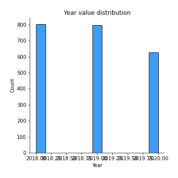
## Feature : Month
- **Feature type** : discrete
- **Missing** : 0.0%
- **Unique** : 12
- **Count** :2226.0
- **Mean** :7.490116801437556
- **Std** :3.494861883087369
- **Min** :1.0
- **25%th Percentile** : 5.0
- **50%th Percentile** : 8.0
- **75%th Percentile** : 11.0
- **Max** :12.0

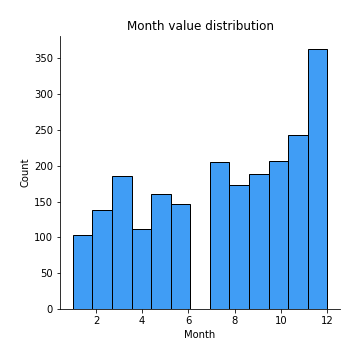
## Feature : Town
- **Feature type** : continous
- **Missing** : 0.0%
- **Unique** : 24
- **Count** :2226.0
- **Mean** :410509.9733491125
- **Std** :165632.05610721136
- **Min** :207913.35539568344
- **25%th Percentile** : 332398.3866366366
- **50%th Percentile** : 353337.5602040816
- **75%th Percentile** : 440456.1540282686
- **Max** :1137529.2432432433

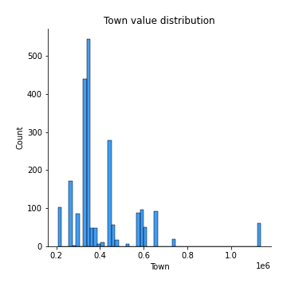
## Feature : Apartment
- **Feature type** : discrete
- **Missing** : 0.0%
- **Unique** : 2
- **Count** :2226.0
- **Mean** :0.042228212039532795
- **Std** :0.20115458650286352
- **Min** :0.0
- **25%th Percentile** : 0.0
- **50%th Percentile** : 0.0
- **75%th Percentile** : 0.0
- **Max** :1.0

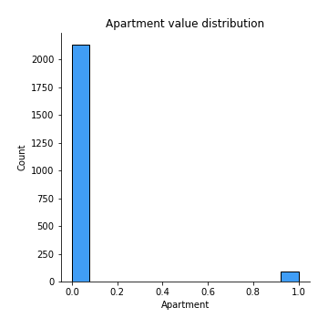
## Feature : Neighbourhood
- **Feature type** : continous
- **Missing** : 0.0%
- **Unique** : 299
- **Count** :2226.0
- **Mean** :418587.79739442945
- **Std** :188455.8211783831
- **Min** :107233.0
- **25%th Percentile** : 322868.0
- **50%th Percentile** : 373223.0
- **75%th Percentile** : 449160.0
- **Max** :1774756.0

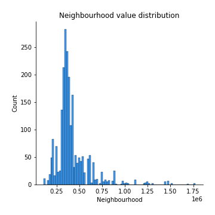
## Feature : Eircode
- **Feature type** : continous
- **Missing** : 0.0%
- **Unique** : 16
- **Count** :2226.0
- **Mean** :407530.66727028677
- **Std** :143454.6011022734
- **Min** :207913.35539568344
- **25%th Percentile** : 332398.3866366366
- **50%th Percentile** : 353337.5602040816
- **75%th Percentile** : 440456.1540282686
- **Max** :794885.1730962343

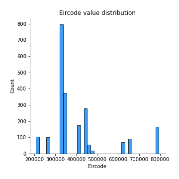
## Feature : Latitude
- **Feature type** : continous
- **Missing** : 0.0%
- **Unique** : 580
- **Count** :2226.0
- **Mean** :53.35709819352113
- **Std** :0.06770085837396816
- **Min** :53.2450576
- **25%th Percentile** : 53.2871703
- **50%th Percentile** : 53.3472378
- **75%th Percentile** : 53.40234405
- **Max** :53.496674

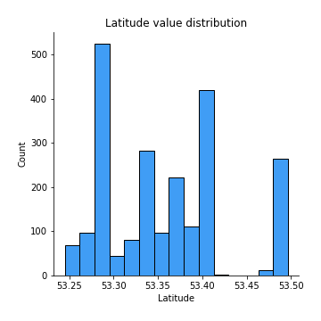
## Feature : Longitude
- **Feature type** : continous
- **Missing** : 0.0%
- **Unique** : 580
- **Count** :2226.0
- **Mean** :-6.2929334680540485
- **Std** :0.12366514880227261
- **Min** :-6.4746232
- **25%th Percentile** : -6.4209564
- **50%th Percentile** : -6.284060779411765
- **75%th Percentile** : -6.1557794
- **Max** :-6.108900772435387

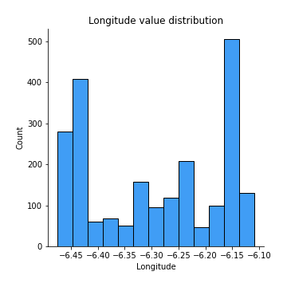
## Feature : DistanceIFSC
- **Feature type** : continous
- **Missing** : 0.0%
- **Unique** : 580
- **Count** :2226.0
- **Mean** :10.811778073557171
- **Std** :4.198028798071867
- **Min** :0.9334758836962448
- **25%th Percentile** : 7.348037048216334
- **50%th Percentile** : 11.11377710549976
- **75%th Percentile** : 14.271496094663704
- **Max** :18.48705658280745

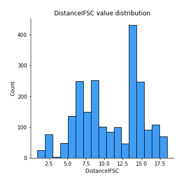
## Feature : DistanceSchool
- **Feature type** : continous
- **Missing** : 0.0%
- **Unique** : 580
- **Count** :2226.0
- **Mean** :0.6754306358876864
- **Std** :0.34535424313851926
- **Min** :0.0753620548765324
- **25%th Percentile** : 0.411923158485652
- **50%th Percentile** : 0.6755505597161495
- **75%th Percentile** : 0.8615648886620051
- **Max** :2.578259051387473

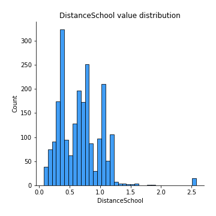
## Feature : DistancePark
- **Feature type** : continous
- **Missing** : 0.0%
- **Unique** : 580
- **Count** :2226.0
- **Mean** :3.8615222907446296
- **Std** :3.1965660703658103
- **Min** :0.0
- **25%th Percentile** : 0.6410900999878978
- **50%th Percentile** : 2.9652851021063755
- **75%th Percentile** : 6.564677523505729
- **Max** :10.479233194327191

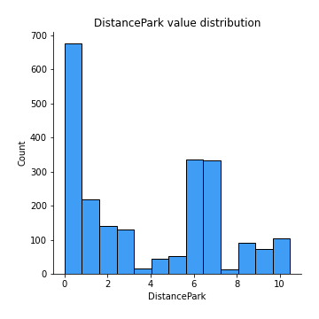
## Feature : DistanceSecSchool
- **Feature type** : continous
- **Missing** : 0.0%
- **Unique** : 574
- **Count** :2226.0
- **Mean** :1.201685352056268
- **Std** :0.7892510808208812
- **Min** :0.0
- **25%th Percentile** : 0.5558397737692032
- **50%th Percentile** : 1.1797344493745983
- **75%th Percentile** : 1.6120521225042546
- **Max** :3.532329838016618

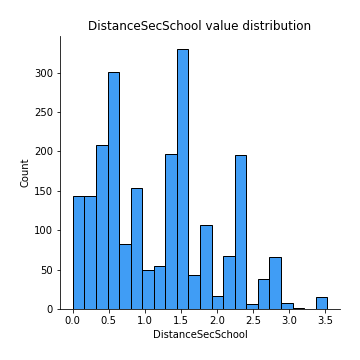

[<< Go back](../README.md)
