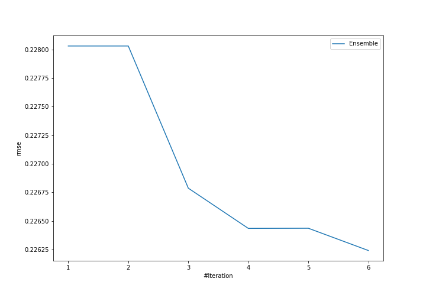
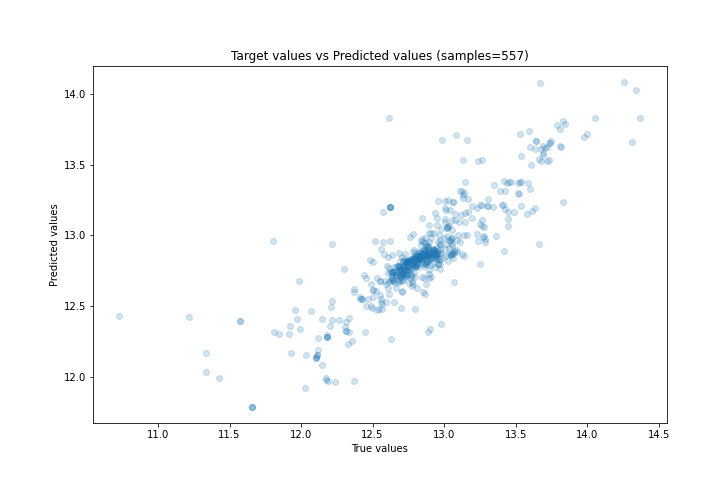
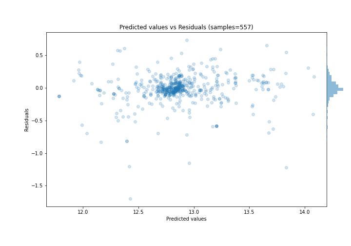

# Summary of Ensemble

[<< Go back](../README.md)

## Ensemble structure
| Model                   |   Weight |
|:------------------------|---------:|
| 4_Default_Xgboost       |        4 |
| 5_Default_NeuralNetwork |        1 |
| 6_Default_RandomForest  |        1 |

### Metric details:
| Metric   |     Score |
|:---------|----------:|
| MAE      | 0.138655  |
| MSE      | 0.0511847 |
| RMSE     | 0.22624   |
| R2       | 0.733031  |
| MAPE     | 0.0109146 |

## Learning curves

## True vs Predicted

## Predicted vs Residuals

[<< Go back](../README.md)
