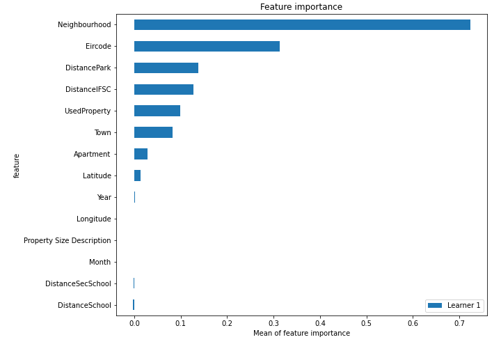
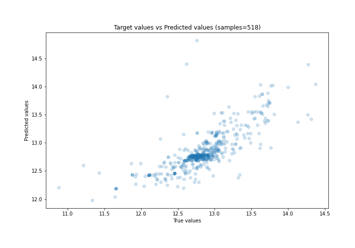
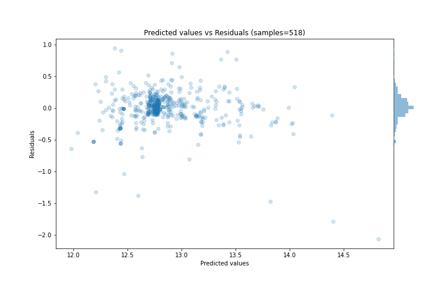
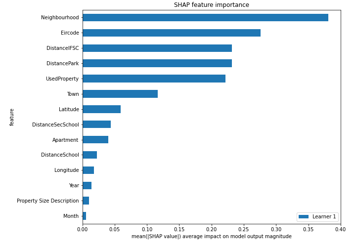
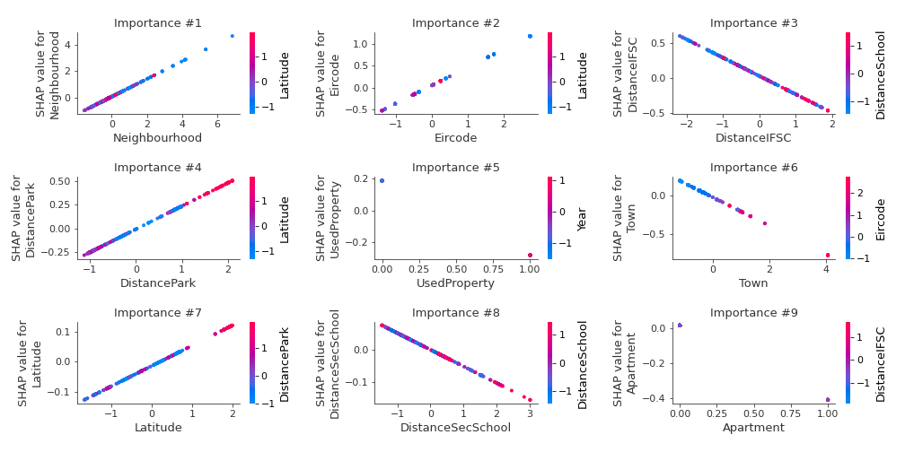
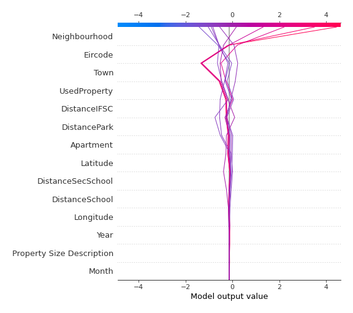
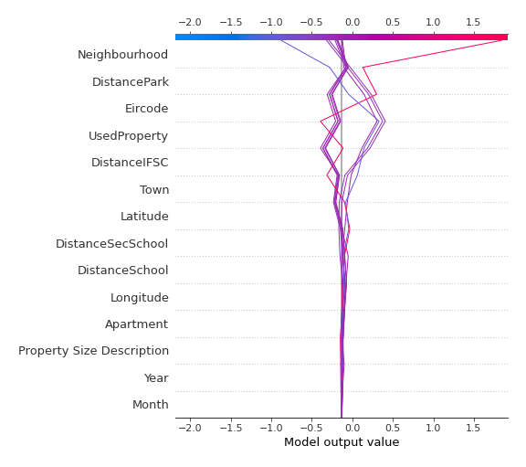

# Summary of 3_Linear

[<< Go back](../README.md)

## Linear Regression (Linear)
- **n_jobs**: -1
- **explain_level**: 2

## Validation
 - **validation_type**: split
 - **train_ratio**: 0.75
 - **shuffle**: True

## Optimized metric
rmse

## Training time

4.6 seconds

### Metric details:
| Metric   |     Score |
|:---------|----------:|
| MAE      | 0.173318  |
| MSE      | 0.077211  |
| RMSE     | 0.277869  |
| R2       | 0.574798  |
| MAPE     | 0.0135961 |

## Learning curves

## Coefficients
| feature                   |   Learner_1 |
|:--------------------------|------------:|
| Neighbourhood             |  0.658945   |
| Eircode                   |  0.411449   |
| DistancePark              |  0.244847   |
| intercept                 |  0.211535   |
| Latitude                  |  0.0677189  |
| Year                      |  0.0174846  |
| Property Size Description |  0.0157683  |
| Month                     | -0.00679068 |
| Longitude                 | -0.0194015  |
| DistanceSchool            | -0.0274927  |
| DistanceSecSchool         | -0.051699   |
| Town                      | -0.187778   |
| DistanceIFSC              | -0.260729   |
| Apartment                 | -0.425347   |
| UsedProperty              | -0.468966   |

## Permutation-based Importance

## True vs Predicted

## Predicted vs Residuals

## SHAP Importance

## SHAP Dependence plots

### Dependence (Fold 1)

## SHAP Decision plots

### Top-10 Worst decisions (Fold 1)

### Top-10 Best decisions (Fold 1)

[<< Go back](../README.md)
