# Exploratory Data Analysis

[<< Go back](../README.md)
## Feature : target
- **Feature type** : continous
- **Missing** : 0.0%
- **Unique** : 1548
- **Count** :2069.0
- **Mean** :12.840536687544512
- **Std** :0.4408016029706773
- **Min** :10.551630044962797
- **25%th Percentile** : 12.659627799766447
- **50%th Percentile** : 12.818237239368615
- **75%th Percentile** : 13.016057726357841
- **Max** :14.487072775310622

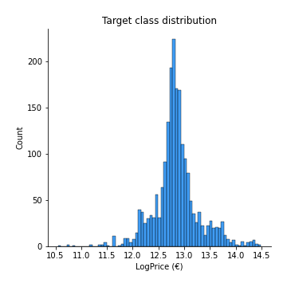
## Feature : UsedProperty
- **Feature type** : discrete
- **Missing** : 0.0%
- **Unique** : 2
- **Count** :2069.0
- **Mean** :0.38521024649589175
- **Std** :0.48676260182275916
- **Min** :0.0
- **25%th Percentile** : 0.0
- **50%th Percentile** : 0.0
- **75%th Percentile** : 1.0
- **Max** :1.0

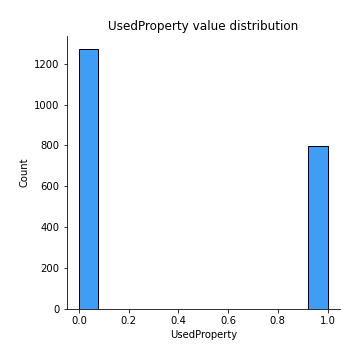
## Feature : Property Size Description
- **Feature type** : discrete
- **Missing** : 0.0%
- **Unique** : 3
- **Count** :2069.0
- **Mean** :1.1652972450459158
- **Std** :0.48848854154389015
- **Min** :0.0
- **25%th Percentile** : 1.0
- **50%th Percentile** : 1.0
- **75%th Percentile** : 1.0
- **Max** :2.0

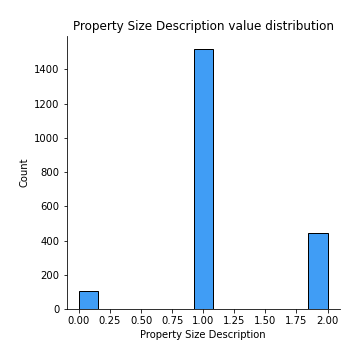
## Feature : Year
- **Feature type** : discrete
- **Missing** : 0.0%
- **Unique** : 3
- **Count** :2069.0
- **Mean** :2018.1575640405993
- **Std** :0.7663858393275587
- **Min** :2017.0
- **25%th Percentile** : 2018.0
- **50%th Percentile** : 2018.0
- **75%th Percentile** : 2019.0
- **Max** :2019.0

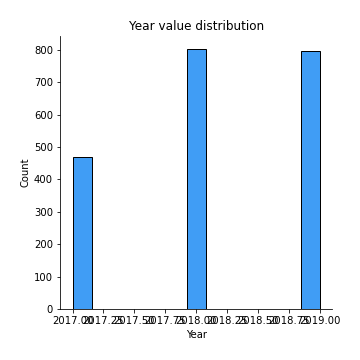
## Feature : Month
- **Feature type** : discrete
- **Missing** : 0.0%
- **Unique** : 12
- **Count** :2069.0
- **Mean** :7.433059449009183
- **Std** :3.4719084555663993
- **Min** :1.0
- **25%th Percentile** : 5.0
- **50%th Percentile** : 8.0
- **75%th Percentile** : 11.0
- **Max** :12.0

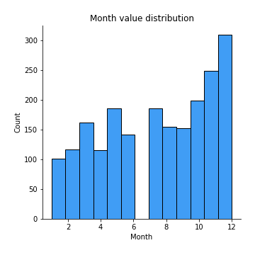
## Feature : Town
- **Feature type** : continous
- **Missing** : 0.0%
- **Unique** : 24
- **Count** :2069.0
- **Mean** :413807.26201199455
- **Std** :176799.38601819836
- **Min** :207913.35539568344
- **25%th Percentile** : 329388.58701886795
- **50%th Percentile** : 353337.5602040816
- **75%th Percentile** : 440456.1540282686
- **Max** :1137529.2432432433

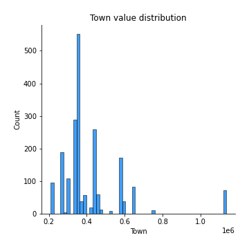
## Feature : Apartment
- **Feature type** : discrete
- **Missing** : 0.0%
- **Unique** : 2
- **Count** :2069.0
- **Mean** :0.06379893668438859
- **Std** :0.24445350208110872
- **Min** :0.0
- **25%th Percentile** : 0.0
- **50%th Percentile** : 0.0
- **75%th Percentile** : 0.0
- **Max** :1.0

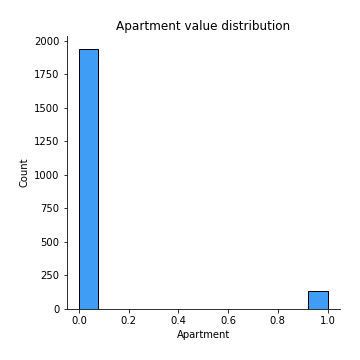
## Feature : Neighbourhood
- **Feature type** : continous
- **Missing** : 0.0%
- **Unique** : 301
- **Count** :2069.0
- **Mean** :416944.3383276945
- **Std** :196511.0546130715
- **Min** :107233.0
- **25%th Percentile** : 322868.0
- **50%th Percentile** : 373223.0
- **75%th Percentile** : 443052.0
- **Max** :1774756.0

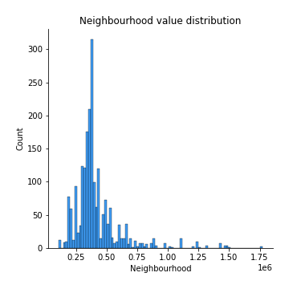
## Feature : Eircode
- **Feature type** : continous
- **Missing** : 0.0%
- **Unique** : 16
- **Count** :2069.0
- **Mean** :405118.16448225774
- **Std** :141130.11536865757
- **Min** :207913.35539568344
- **25%th Percentile** : 333925.60328253225
- **50%th Percentile** : 353337.5602040816
- **75%th Percentile** : 440456.1540282686
- **Max** :794885.1730962343

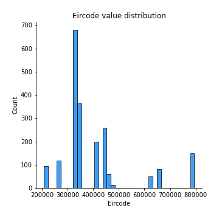
## Feature : Latitude
- **Feature type** : continous
- **Missing** : 0.0%
- **Unique** : 487
- **Count** :2069.0
- **Mean** :53.359545421582624
- **Std** :0.06855027971483593
- **Min** :53.2452925
- **25%th Percentile** : 53.2871703
- **50%th Percentile** : 53.3679175
- **75%th Percentile** : 53.404602
- **Max** :53.496674

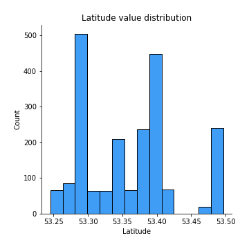
## Feature : Longitude
- **Feature type** : continous
- **Missing** : 0.0%
- **Unique** : 487
- **Count** :2069.0
- **Mean** :-6.279563498859184
- **Std** :0.11880069947298964
- **Min** :-6.4746232
- **25%th Percentile** : -6.418383
- **50%th Percentile** : -6.2579949
- **75%th Percentile** : -6.1545784
- **Max** :-6.1064329844499134

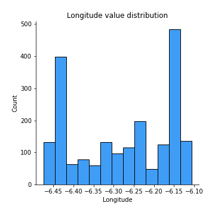
## Feature : DistanceIFSC
- **Feature type** : continous
- **Missing** : 0.0%
- **Unique** : 487
- **Count** :2069.0
- **Mean** :10.44524213979622
- **Std** :4.174761072155214
- **Min** :0.9334758836962448
- **25%th Percentile** : 7.232753023880104
- **50%th Percentile** : 9.55371444456686
- **75%th Percentile** : 14.271496094663704
- **Max** :18.48705658280745

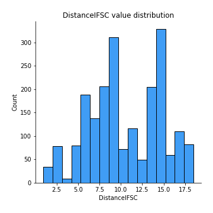
## Feature : DistanceSchool
- **Feature type** : continous
- **Missing** : 0.0%
- **Unique** : 487
- **Count** :2069.0
- **Mean** :0.6933456407110024
- **Std** :0.35776984422998764
- **Min** :0.0600966056161143
- **25%th Percentile** : 0.411923158485652
- **50%th Percentile** : 0.688988902120328
- **75%th Percentile** : 0.9717354241019096
- **Max** :2.578259051387473

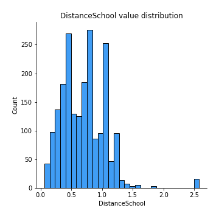
## Feature : DistancePark
- **Feature type** : continous
- **Missing** : 0.0%
- **Unique** : 487
- **Count** :2069.0
- **Mean** :3.6229250467528993
- **Std** :3.215564950828711
- **Min** :0.0
- **25%th Percentile** : 0.6270341538663887
- **50%th Percentile** : 2.410675126043056
- **75%th Percentile** : 6.429799133871497
- **Max** :10.479233194327191

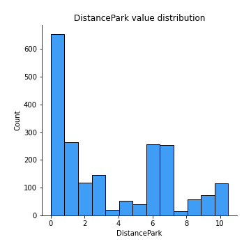
## Feature : DistanceSecSchool
- **Feature type** : continous
- **Missing** : 0.0%
- **Unique** : 482
- **Count** :2069.0
- **Mean** :1.1567203504861514
- **Std** :0.7876096959408796
- **Min** :0.0
- **25%th Percentile** : 0.5468287621063288
- **50%th Percentile** : 0.9728213148169672
- **75%th Percentile** : 1.604867122806096
- **Max** :3.532329838016618

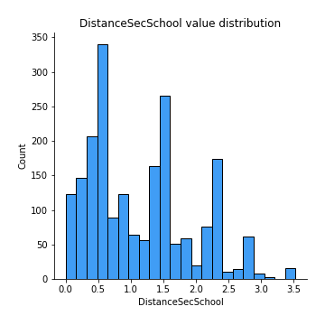

[<< Go back](../README.md)
