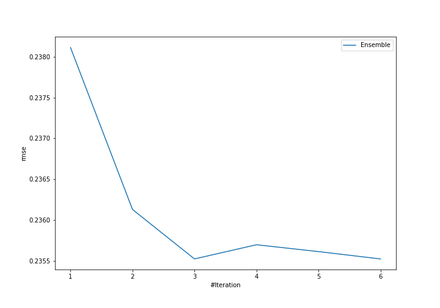
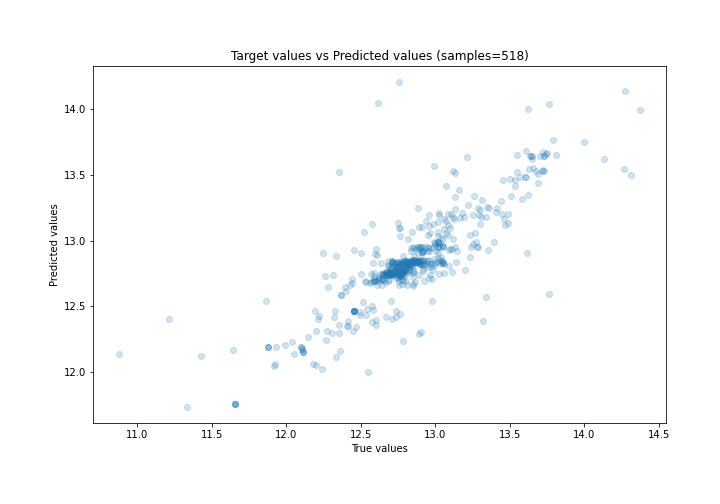
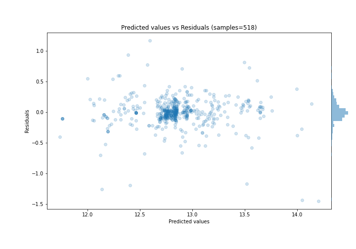

# Summary of Ensemble

[<< Go back](../README.md)

## Ensemble structure
| Model                  |   Weight |
|:-----------------------|---------:|
| 4_Default_Xgboost      |        2 |
| 6_Default_RandomForest |        1 |

### Metric details:
| Metric   |     Score |
|:---------|----------:|
| MAE      | 0.143052  |
| MSE      | 0.0554706 |
| RMSE     | 0.235522  |
| R2       | 0.694522  |
| MAPE     | 0.011186  |

## Learning curves

## True vs Predicted

## Predicted vs Residuals

[<< Go back](../README.md)
