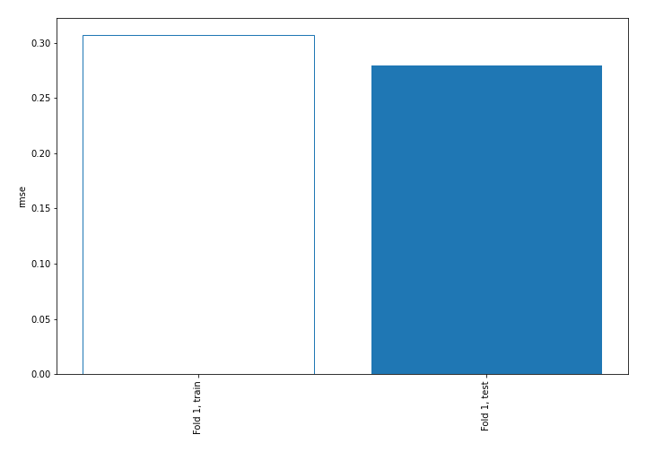
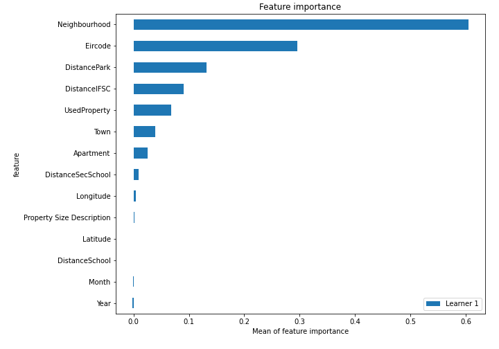
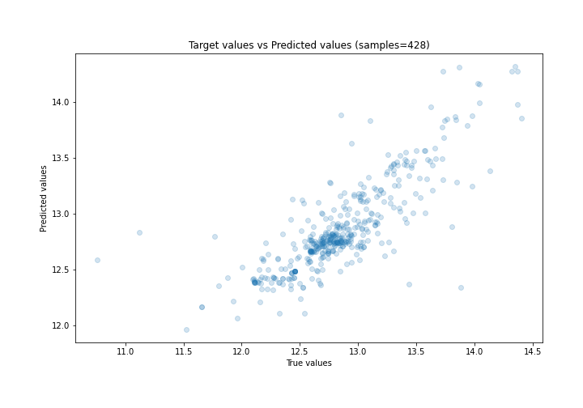
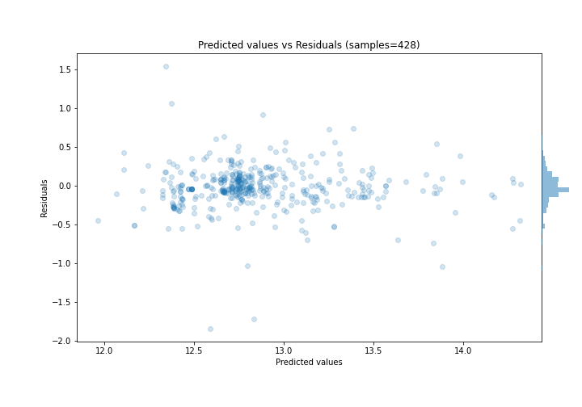
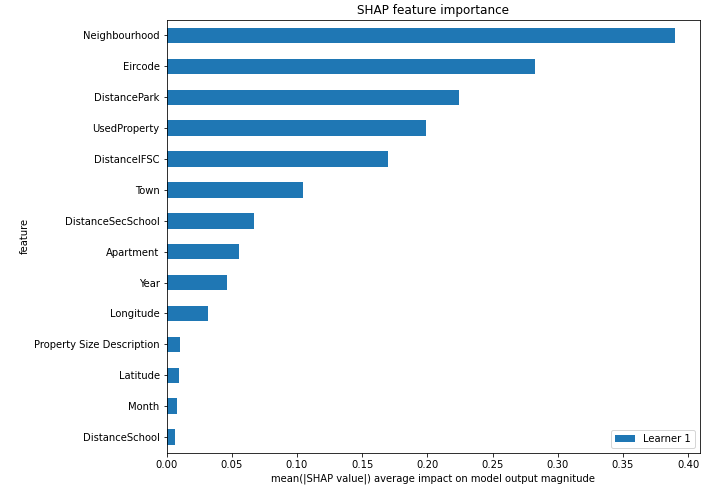
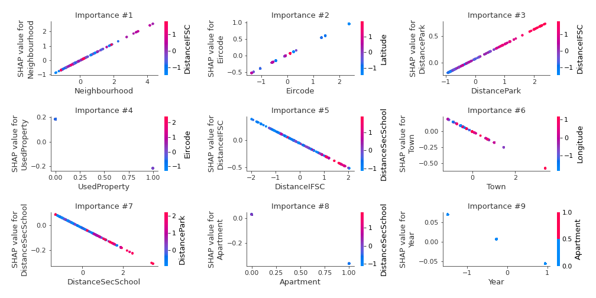
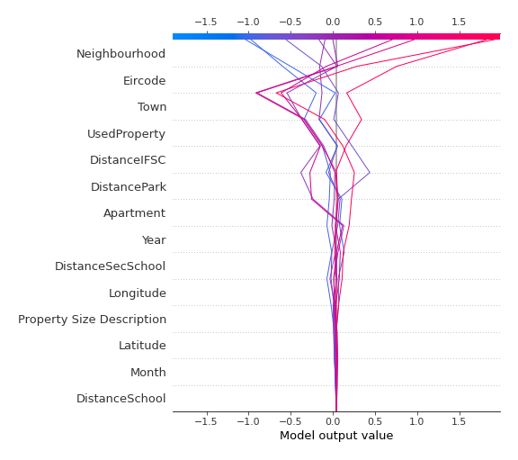
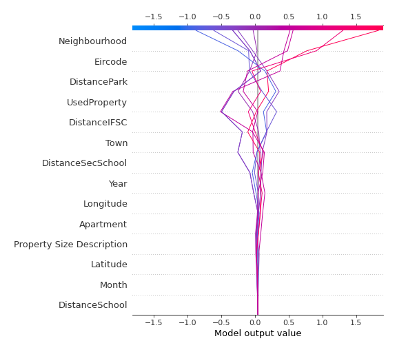

# Summary of 3_Linear

[<< Go back](../README.md)

## Linear Regression (Linear)
- **n_jobs**: -1
- **explain_level**: 2

## Validation
 - **validation_type**: split
 - **train_ratio**: 0.75
 - **shuffle**: True

## Optimized metric
rmse

## Training time

3.5 seconds

### Metric details:
| Metric   |     Score |
|:---------|----------:|
| MAE      | 0.18036   |
| MSE      | 0.0778241 |
| RMSE     | 0.27897   |
| R2       | 0.660881  |
| MAPE     | 0.0141431 |

## Learning curves

## Coefficients
| feature                   |   Learner_1 |
|:--------------------------|------------:|
| Neighbourhood             |  0.589044   |
| Eircode                   |  0.397675   |
| DistancePark              |  0.280186   |
| intercept                 |  0.228662   |
| Longitude                 |  0.036852   |
| Property Size Description |  0.014681   |
| Latitude                  |  0.0110881  |
| Month                     |  0.00899669 |
| DistanceSchool            |  0.00839795 |
| Year                      | -0.0517233  |
| DistanceSecSchool         | -0.0827395  |
| Town                      | -0.166069   |
| DistanceIFSC              | -0.226014   |
| Apartment                 | -0.39487    |
| UsedProperty              | -0.399768   |

## Permutation-based Importance

## True vs Predicted

## Predicted vs Residuals

## SHAP Importance

## SHAP Dependence plots

### Dependence (Fold 1)

## SHAP Decision plots

### Top-10 Worst decisions (Fold 1)

### Top-10 Best decisions (Fold 1)

[<< Go back](../README.md)
