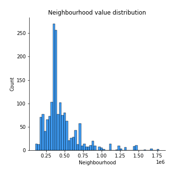

# Exploratory Data Analysis

[<< Go back](../README.md)
## Feature : target
- **Feature type** : continous
- **Missing** : 0.0%
- **Unique** : 1340
- **Count** :1709.0
- **Mean** :12.874013521591488
- **Std** :0.5141020027551059
- **Min** :10.551630044962797
- **25%th Percentile** : 12.615311723247894
- **50%th Percentile** : 12.826339891896716
- **75%th Percentile** : 13.116923870072124
- **Max** :14.628186103540166

## Feature : UsedProperty
- **Feature type** : discrete
- **Missing** : 0.0%
- **Unique** : 2
- **Count** :1709.0
- **Mean** :0.483908718548859
- **Std** :0.4998872763800929
- **Min** :0.0
- **25%th Percentile** : 0.0
- **50%th Percentile** : 0.0
- **75%th Percentile** : 1.0
- **Max** :1.0

## Feature : Property Size Description
- **Feature type** : discrete
- **Missing** : 0.0%
- **Unique** : 3
- **Count** :1709.0
- **Mean** :1.1673493270918667
- **Std** :0.44494170634403446
- **Min** :0.0
- **25%th Percentile** : 1.0
- **50%th Percentile** : 1.0
- **75%th Percentile** : 1.0
- **Max** :2.0

## Feature : Year
- **Feature type** : discrete
- **Missing** : 0.0%
- **Unique** : 3
- **Count** :1709.0
- **Mean** :2017.2147454651843
- **Std** :0.8241766931149084
- **Min** :2016.0
- **25%th Percentile** : 2016.0
- **50%th Percentile** : 2017.0
- **75%th Percentile** : 2018.0
- **Max** :2018.0

## Feature : Month
- **Feature type** : discrete
- **Missing** : 0.0%
- **Unique** : 12
- **Count** :1709.0
- **Mean** :7.406085430076068
- **Std** :3.426219394507821
- **Min** :1.0
- **25%th Percentile** : 5.0
- **50%th Percentile** : 8.0
- **75%th Percentile** : 11.0
- **Max** :12.0

## Feature : Town
- **Feature type** : continous
- **Missing** : 0.0%
- **Unique** : 24
- **Count** :1709.0
- **Mean** :439570.74068965047
- **Std** :197598.42072716777
- **Min** :207913.35539568344
- **25%th Percentile** : 332398.3866366366
- **50%th Percentile** : 353337.5602040816
- **75%th Percentile** : 570683.0819259259
- **Max** :1137529.2432432433

## Feature : Apartment
- **Feature type** : discrete
- **Missing** : 0.0%
- **Unique** : 2
- **Count** :1709.0
- **Mean** :0.08191925102399064
- **Std** :0.2743219284123489
- **Min** :0.0
- **25%th Percentile** : 0.0
- **50%th Percentile** : 0.0
- **75%th Percentile** : 0.0
- **Max** :1.0

## Feature : Neighbourhood
- **Feature type** : continous
- **Missing** : 0.0%
- **Unique** : 299
- **Count** :1709.0
- **Mean** :447621.6869514336
- **Std** :232163.26219823238
- **Min** :107233.0
- **25%th Percentile** : 323788.0
- **50%th Percentile** : 379563.0
- **75%th Percentile** : 500206.0
- **Max** :1774756.0

## Feature : Eircode
- **Feature type** : continous
- **Missing** : 0.0%
- **Unique** : 16
- **Count** :1709.0
- **Mean** :421275.5582318565
- **Std** :155818.4797305585
- **Min** :207913.35539568344
- **25%th Percentile** : 333925.60328253225
- **50%th Percentile** : 353337.5602040816
- **75%th Percentile** : 440456.1540282686
- **Max** :794885.1730962343

## Feature : Latitude
- **Feature type** : continous
- **Missing** : 0.0%
- **Unique** : 456
- **Count** :1709.0
- **Mean** :53.35966727064093
- **Std** :0.06767016074147726
- **Min** :53.2450576
- **25%th Percentile** : 53.2876335
- **50%th Percentile** : 53.37094595
- **75%th Percentile** : 53.404602
- **Max** :53.496674

## Feature : Longitude
- **Feature type** : continous
- **Missing** : 0.0%
- **Unique** : 456
- **Count** :1709.0
- **Mean** :-6.25610590678324
- **Std** :0.10961076640211012
- **Min** :-6.4667684
- **25%th Percentile** : -6.347220945887603
- **50%th Percentile** : -6.2399586
- **75%th Percentile** : -6.1545031493635936
- **Max** :-6.1064329844499134

## Feature : DistanceIFSC
- **Feature type** : continous
- **Missing** : 0.0%
- **Unique** : 456
- **Count** :1709.0
- **Mean** :9.713599547762907
- **Std** :4.113074577275357
- **Min** :1.0181268510976729
- **25%th Percentile** : 7.070232778306495
- **50%th Percentile** : 8.703010286862993
- **75%th Percentile** : 13.357435069127492
- **Max** :18.48705658280745

## Feature : DistanceSchool
- **Feature type** : continous
- **Missing** : 0.0%
- **Unique** : 456
- **Count** :1709.0
- **Mean** :0.6792269393653358
- **Std** :0.35754021275727427
- **Min** :0.0600966056161143
- **25%th Percentile** : 0.411923158485652
- **50%th Percentile** : 0.688988902120328
- **75%th Percentile** : 0.853146648545682
- **Max** :2.605576624109076

## Feature : DistancePark
- **Feature type** : continous
- **Missing** : 0.0%
- **Unique** : 456
- **Count** :1709.0
- **Mean** :3.118964663502878
- **Std** :3.0353297481266526
- **Min** :0.0835756487985044
- **25%th Percentile** : 0.6270341538663887
- **50%th Percentile** : 1.7182369632678631
- **75%th Percentile** : 5.722453442908488
- **Max** :10.479233194327191

## Feature : DistanceSecSchool
- **Feature type** : continous
- **Missing** : 0.0%
- **Unique** : 451
- **Count** :1709.0
- **Mean** :0.9802770907111161
- **Std** :0.7396255005387793
- **Min** :0.0
- **25%th Percentile** : 0.4574413388621641
- **50%th Percentile** : 0.6798232960988252
- **75%th Percentile** : 1.477684469317993
- **Max** :3.532329838016618

[<< Go back](../README.md)
