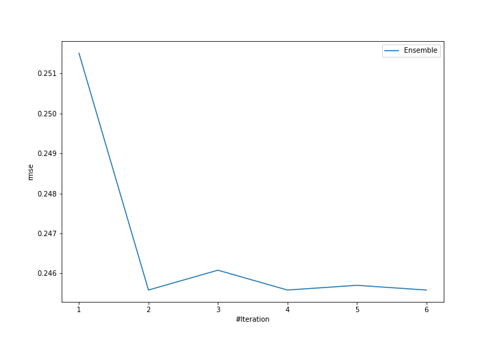
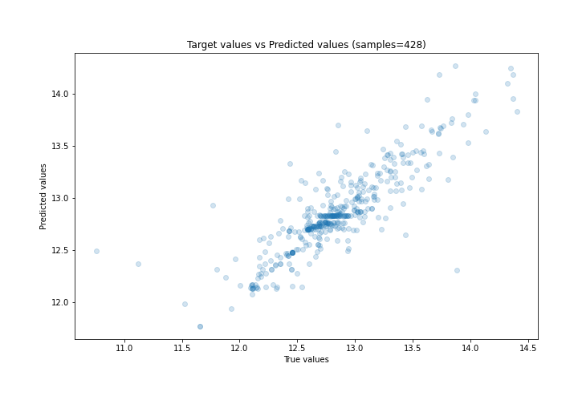
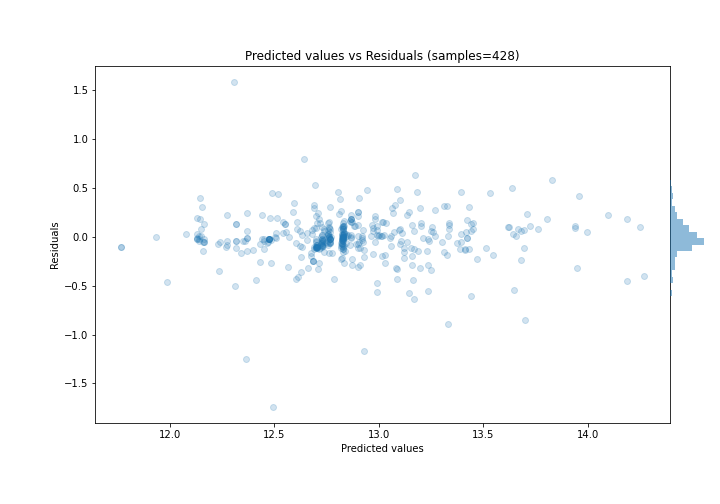

# Summary of Ensemble

[<< Go back](../README.md)

## Ensemble structure
| Model                  |   Weight |
|:-----------------------|---------:|
| 4_Default_Xgboost      |        3 |
| 6_Default_RandomForest |        3 |

### Metric details:
| Metric   |     Score |
|:---------|----------:|
| MAE      | 0.153224  |
| MSE      | 0.060311  |
| RMSE     | 0.245583  |
| R2       | 0.737194  |
| MAPE     | 0.0119762 |

## Learning curves

## True vs Predicted

## Predicted vs Residuals

[<< Go back](../README.md)
