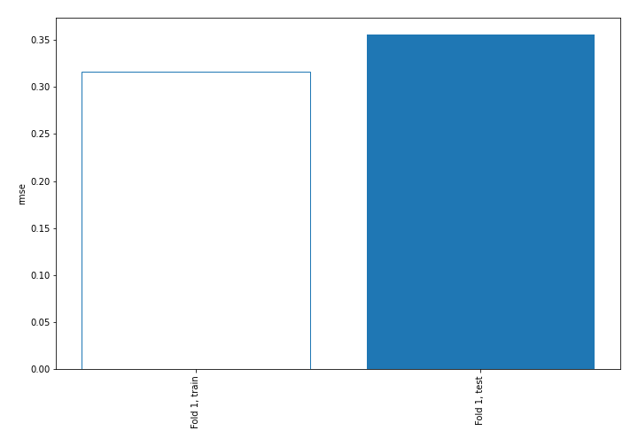
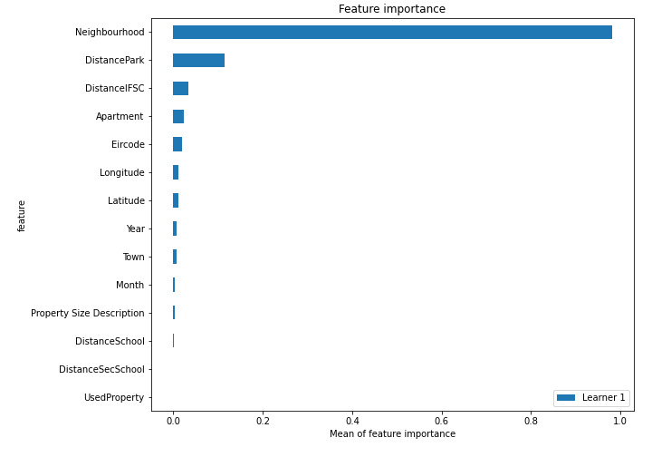
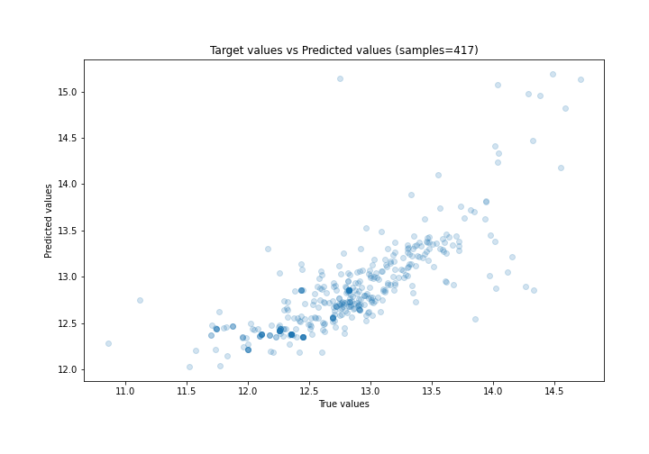
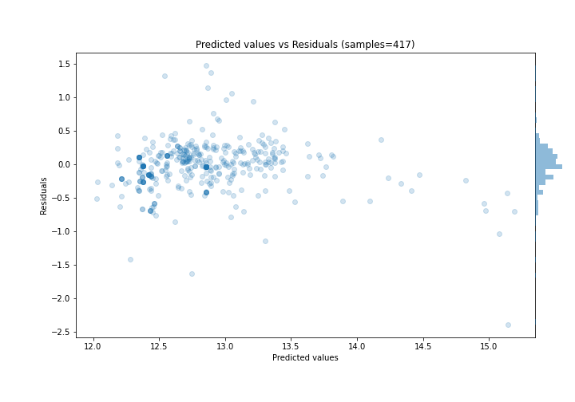
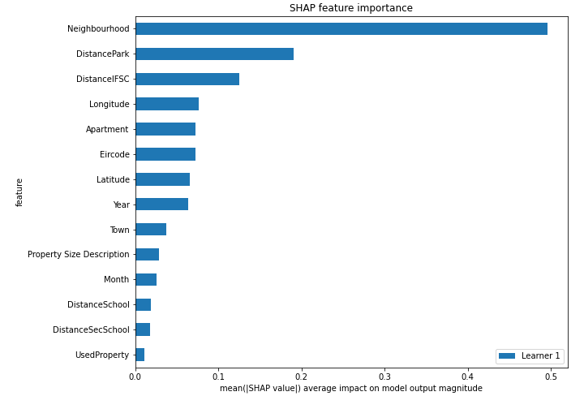
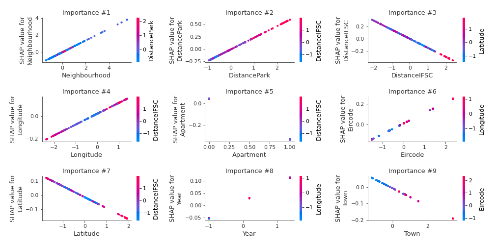
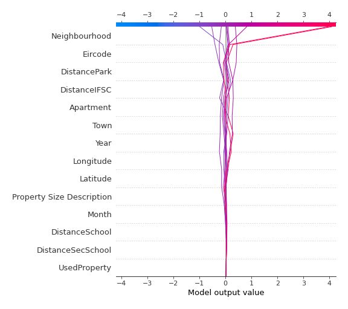
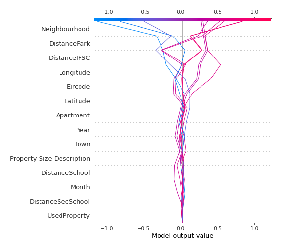

# Summary of 3_Linear

[<< Go back](../README.md)

## Linear Regression (Linear)
- **n_jobs**: -1
- **explain_level**: 2

## Validation
 - **validation_type**: split
 - **train_ratio**: 0.75
 - **shuffle**: True

## Optimized metric
rmse

## Training time

3.6 seconds

### Metric details:
| Metric   |     Score |
|:---------|----------:|
| MAE      | 0.2394    |
| MSE      | 0.126667  |
| RMSE     | 0.355903  |
| R2       | 0.629959  |
| MAPE     | 0.0187438 |

## Learning curves

## Coefficients
| feature                   |   Learner_1 |
|:--------------------------|------------:|
| Neighbourhood             |   0.692324  |
| DistancePark              |   0.234023  |
| Eircode                   |   0.102872  |
| Longitude                 |   0.0975082 |
| Year                      |   0.0704434 |
| Property Size Description |   0.0392735 |
| intercept                 |   0.0347805 |
| Month                     |   0.0278349 |
| DistanceSchool            |   0.0270875 |
| UsedProperty              |   0.0117395 |
| DistanceSecSchool         |  -0.0276785 |
| Town                      |  -0.054402  |
| Latitude                  |  -0.0777814 |
| DistanceIFSC              |  -0.148964  |
| Apartment                 |  -0.377747  |

## Permutation-based Importance

## True vs Predicted

## Predicted vs Residuals

## SHAP Importance

## SHAP Dependence plots

### Dependence (Fold 1)

## SHAP Decision plots

### Top-10 Worst decisions (Fold 1)

### Top-10 Best decisions (Fold 1)

[<< Go back](../README.md)
