# Exploratory Data Analysis

[<< Go back](../README.md)
## Feature : target
- **Feature type** : continous
- **Missing** : 0.0%
- **Unique** : 1136
- **Count** :1666.0
- **Mean** :12.830310166932685
- **Std** :0.5706675717116994
- **Min** :10.755090205422828
- **25%th Percentile** : 12.42209972886198
- **50%th Percentile** : 12.824414154694272
- **75%th Percentile** : 13.1386460402578
- **Max** :14.783172102221382

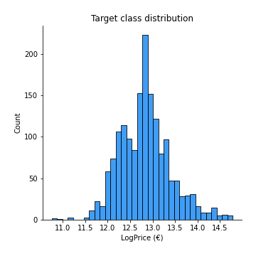
## Feature : UsedProperty
- **Feature type** : discrete
- **Missing** : 0.0%
- **Unique** : 2
- **Count** :1666.0
- **Mean** :0.5648259303721489
- **Std** :0.495928649038165
- **Min** :0.0
- **25%th Percentile** : 0.0
- **50%th Percentile** : 1.0
- **75%th Percentile** : 1.0
- **Max** :1.0

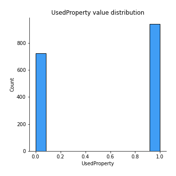
## Feature : Property Size Description
- **Feature type** : discrete
- **Missing** : 0.0%
- **Unique** : 3
- **Count** :1666.0
- **Mean** :1.148859543817527
- **Std** :0.44726921381823376
- **Min** :0.0
- **25%th Percentile** : 1.0
- **50%th Percentile** : 1.0
- **75%th Percentile** : 1.0
- **Max** :2.0

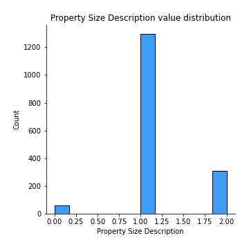
## Feature : Year
- **Feature type** : discrete
- **Missing** : 0.0%
- **Unique** : 3
- **Count** :1666.0
- **Mean** :2015.8259303721488
- **Std** :0.8416770788485222
- **Min** :2015.0
- **25%th Percentile** : 2015.0
- **50%th Percentile** : 2016.0
- **75%th Percentile** : 2017.0
- **Max** :2017.0

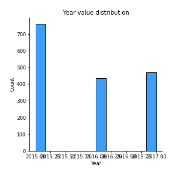
## Feature : Month
- **Feature type** : discrete
- **Missing** : 0.0%
- **Unique** : 12
- **Count** :1666.0
- **Mean** :6.709483793517407
- **Std** :3.495118015687198
- **Min** :1.0
- **25%th Percentile** : 4.0
- **50%th Percentile** : 6.0
- **75%th Percentile** : 10.0
- **Max** :12.0

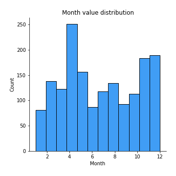
## Feature : Town
- **Feature type** : continous
- **Missing** : 0.0%
- **Unique** : 24
- **Count** :1666.0
- **Mean** :440129.8980601514
- **Std** :200557.70539177998
- **Min** :207913.35539568344
- **25%th Percentile** : 294910.30022922636
- **50%th Percentile** : 389601.92571428575
- **75%th Percentile** : 570683.0819259259
- **Max** :1137529.2432432433

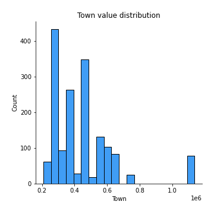
## Feature : Apartment
- **Feature type** : discrete
- **Missing** : 0.0%
- **Unique** : 2
- **Count** :1666.0
- **Mean** :0.09303721488595439
- **Std** :0.2905718000539445
- **Min** :0.0
- **25%th Percentile** : 0.0
- **50%th Percentile** : 0.0
- **75%th Percentile** : 0.0
- **Max** :1.0

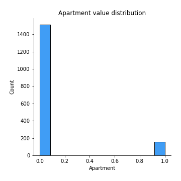
## Feature : Neighbourhood
- **Feature type** : continous
- **Missing** : 0.0%
- **Unique** : 305
- **Count** :1666.0
- **Mean** :439806.3169267707
- **Std** :245252.13614103987
- **Min** :107233.0
- **25%th Percentile** : 286950.0
- **50%th Percentile** : 379563.0
- **75%th Percentile** : 490746.0
- **Max** :1774756.0

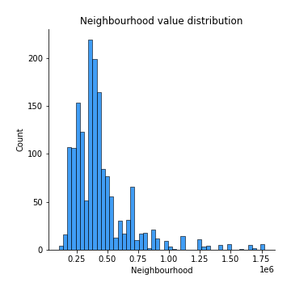
## Feature : Eircode
- **Feature type** : continous
- **Missing** : 0.0%
- **Unique** : 16
- **Count** :1666.0
- **Mean** :439917.4857686076
- **Std** :152056.39518340272
- **Min** :207913.35539568344
- **25%th Percentile** : 333925.60328253225
- **50%th Percentile** : 411979.7255116697
- **75%th Percentile** : 460854.4194939271
- **Max** :794885.1730962343

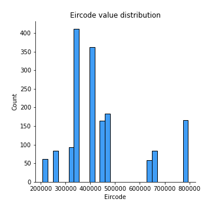
## Feature : Latitude
- **Feature type** : continous
- **Missing** : 0.0%
- **Unique** : 487
- **Count** :1666.0
- **Mean** :53.362009716806476
- **Std** :0.0674673646177425
- **Min** :53.2437063
- **25%th Percentile** : 53.288172275
- **50%th Percentile** : 53.376979899999995
- **75%th Percentile** : 53.404602
- **Max** :53.4951111

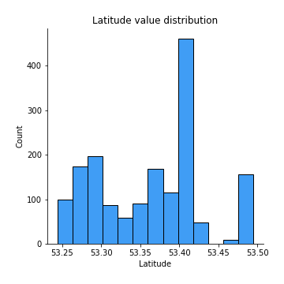
## Feature : Longitude
- **Feature type** : continous
- **Missing** : 0.0%
- **Unique** : 487
- **Count** :1666.0
- **Mean** :-6.2428820365992825
- **Std** :0.09216578856868966
- **Min** :-6.4661526
- **25%th Percentile** : -6.289383175
- **50%th Percentile** : -6.2383408
- **75%th Percentile** : -6.1570658
- **Max** :-6.1064329844499134

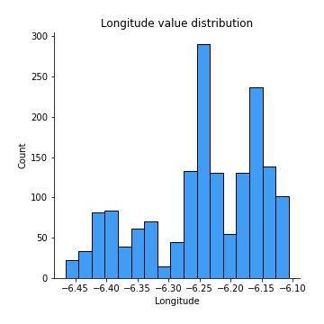
## Feature : DistanceIFSC
- **Feature type** : continous
- **Missing** : 0.0%
- **Unique** : 487
- **Count** :1666.0
- **Mean** :8.991142503880978
- **Std** :3.849217378841824
- **Min** :1.0157248330413609
- **25%th Percentile** : 6.307048449372215
- **50%th Percentile** : 8.325395491800595
- **75%th Percentile** : 11.376861544861915
- **Max** :18.419186783984827

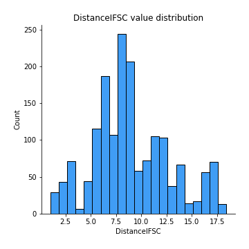
## Feature : DistanceSchool
- **Feature type** : continous
- **Missing** : 0.0%
- **Unique** : 487
- **Count** :1666.0
- **Mean** :0.6546148174383399
- **Std** :0.3518461251776757
- **Min** :0.0600966056161143
- **25%th Percentile** : 0.3832258025478617
- **50%th Percentile** : 0.6297188528057711
- **75%th Percentile** : 0.7935152355809898
- **Max** :2.605576624109076

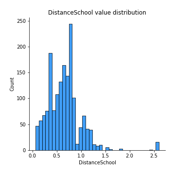
## Feature : DistancePark
- **Feature type** : continous
- **Missing** : 0.0%
- **Unique** : 487
- **Count** :1666.0
- **Mean** :2.8221605350085084
- **Std** :2.8397891369623998
- **Min** :0.1335983905886578
- **25%th Percentile** : 0.6266800696319258
- **50%th Percentile** : 1.435962264704126
- **75%th Percentile** : 4.5815687218756285
- **Max** :10.420266203246037

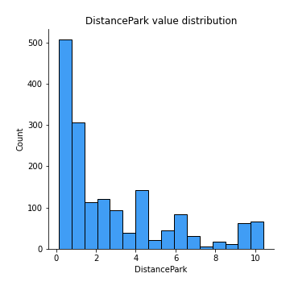
## Feature : DistanceSecSchool
- **Feature type** : continous
- **Missing** : 0.0%
- **Unique** : 483
- **Count** :1666.0
- **Mean** :0.8783175153873956
- **Std** :0.6894356953898116
- **Min** :0.0
- **25%th Percentile** : 0.4537274251790744
- **50%th Percentile** : 0.6033633857847835
- **75%th Percentile** : 1.0657700138703703
- **Max** :3.532329838016618

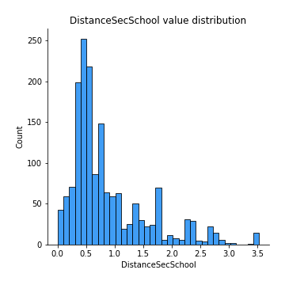

[<< Go back](../README.md)
