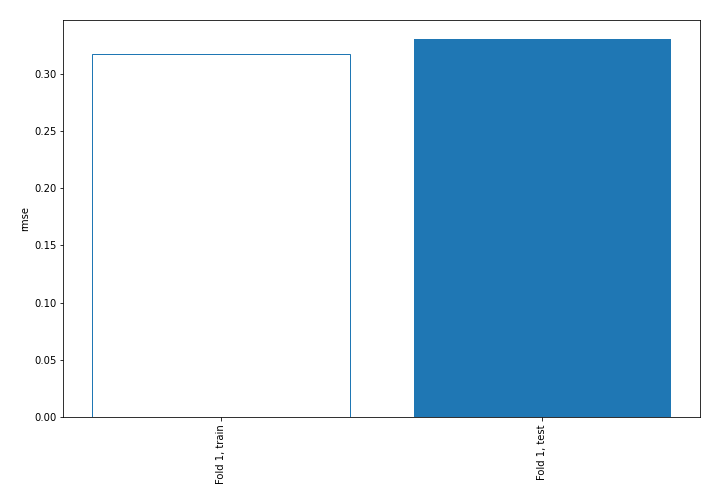

# Summary of 3_Linear

[<< Go back](../README.md)

## Linear Regression (Linear)
- **n_jobs**: -1
- **explain_level**: 2

## Validation
 - **validation_type**: split
 - **train_ratio**: 0.75
 - **shuffle**: True

## Optimized metric
rmse

## Training time

4.0 seconds

### Metric details:
| Metric   |     Score |
|:---------|----------:|
| MAE      | 0.237114  |
| MSE      | 0.109043  |
| RMSE     | 0.330217  |
| R2       | 0.666147  |
| MAPE     | 0.0184849 |

## Learning curves

## Coefficients
| feature                   |   Learner_1 |
|:--------------------------|------------:|
| Neighbourhood             |   0.658991  |
| DistancePark              |   0.342313  |
| Eircode                   |   0.16743   |
| Longitude                 |   0.0589763 |
| Year                      |   0.042668  |
| Property Size Description |   0.0407597 |
| intercept                 |   0.0334808 |
| Month                     |   0.0261374 |
| DistanceSecSchool         |  -0.0156604 |
| UsedProperty              |  -0.0335048 |
| DistanceSchool            |  -0.0381165 |
| Town                      |  -0.0594508 |
| Latitude                  |  -0.0898062 |
| Apartment                 |  -0.14598   |
| DistanceIFSC              |  -0.202558  |

## Permutation-based Importance

## True vs Predicted

## Predicted vs Residuals

## SHAP Importance

## SHAP Dependence plots

### Dependence (Fold 1)

## SHAP Decision plots

### Top-10 Worst decisions (Fold 1)

### Top-10 Best decisions (Fold 1)

[<< Go back](../README.md)
