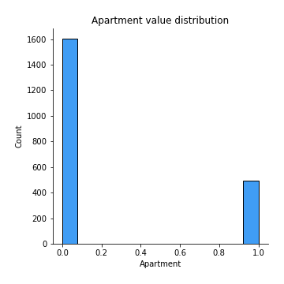

# Exploratory Data Analysis

[<< Go back](../README.md)
## Feature : target
- **Feature type** : continous
- **Missing** : 0.0%
- **Unique** : 1174
- **Count** :2099.0
- **Mean** :12.819469112988333
- **Std** :0.5793065809803029
- **Min** :10.86033733236312
- **25%th Percentile** : 12.352728768336087
- **50%th Percentile** : 12.844068018257307
- **75%th Percentile** : 13.132400990736597
- **Max** :14.818149030336734

## Feature : UsedProperty
- **Feature type** : discrete
- **Missing** : 0.0%
- **Unique** : 2
- **Count** :2099.0
- **Mean** :0.5831348261076703
- **Std** :0.49315764975707554
- **Min** :0.0
- **25%th Percentile** : 0.0
- **50%th Percentile** : 1.0
- **75%th Percentile** : 1.0
- **Max** :1.0

## Feature : Property Size Description
- **Feature type** : discrete
- **Missing** : 0.0%
- **Unique** : 3
- **Count** :2099.0
- **Mean** :1.0643163411148167
- **Std** :0.4863814041764331
- **Min** :0.0
- **25%th Percentile** : 1.0
- **50%th Percentile** : 1.0
- **75%th Percentile** : 1.0
- **Max** :2.0

## Feature : Year
- **Feature type** : discrete
- **Missing** : 0.0%
- **Unique** : 3
- **Count** :2099.0
- **Mean** :2014.7775131014769
- **Std** :0.7672697495873774
- **Min** :2014.0
- **25%th Percentile** : 2014.0
- **50%th Percentile** : 2015.0
- **75%th Percentile** : 2015.0
- **Max** :2016.0

## Feature : Month
- **Feature type** : discrete
- **Missing** : 0.0%
- **Unique** : 12
- **Count** :2099.0
- **Mean** :7.318723201524535
- **Std** :3.4425541830495043
- **Min** :1.0
- **25%th Percentile** : 4.0
- **50%th Percentile** : 7.0
- **75%th Percentile** : 10.0
- **Max** :12.0

## Feature : Town
- **Feature type** : continous
- **Missing** : 0.0%
- **Unique** : 24
- **Count** :2099.0
- **Mean** :456003.5581147381
- **Std** :187799.2619625617
- **Min** :207913.35539568344
- **25%th Percentile** : 294910.30022922636
- **50%th Percentile** : 440456.1540282686
- **75%th Percentile** : 570683.0819259259
- **Max** :1137529.2432432433

## Feature : Apartment
- **Feature type** : discrete
- **Missing** : 0.0%
- **Unique** : 2
- **Count** :2099.0
- **Mean** :0.2358265840876608
- **Std** :0.4246154773011393
- **Min** :0.0
- **25%th Percentile** : 0.0
- **50%th Percentile** : 0.0
- **75%th Percentile** : 0.0
- **Max** :1.0

## Feature : Neighbourhood
- **Feature type** : continous
- **Missing** : 0.0%
- **Unique** : 313
- **Count** :2099.0
- **Mean** :436521.365412101
- **Std** :222942.09008259454
- **Min** :107233.0
- **25%th Percentile** : 286950.0
- **50%th Percentile** : 433065.0
- **75%th Percentile** : 472299.0
- **Max** :1774756.0

## Feature : Eircode
- **Feature type** : continous
- **Missing** : 0.0%
- **Unique** : 16
- **Count** :2099.0
- **Mean** :460504.1890804288
- **Std** :149178.3209395607
- **Min** :207913.35539568344
- **25%th Percentile** : 333925.60328253225
- **50%th Percentile** : 440456.1540282686
- **75%th Percentile** : 460854.4194939271
- **Max** :794885.1730962343

## Feature : Latitude
- **Feature type** : continous
- **Missing** : 0.0%
- **Unique** : 549
- **Count** :2099.0
- **Mean** :53.349037269792305
- **Std** :0.06795187624766973
- **Min** :53.2437063
- **25%th Percentile** : 53.27821994999999
- **50%th Percentile** : 53.3482007
- **75%th Percentile** : 53.403394000000006
- **Max** :53.4951111

## Feature : Longitude
- **Feature type** : continous
- **Missing** : 0.0%
- **Unique** : 549
- **Count** :2099.0
- **Mean** :-6.23832980621316
- **Std** :0.08209319784259637
- **Min** :-6.464394
- **25%th Percentile** : -6.2900213
- **50%th Percentile** : -6.215623250000004
- **75%th Percentile** : -6.1772661
- **Max** :-6.108900772435387

## Feature : DistanceIFSC
- **Feature type** : continous
- **Missing** : 0.0%
- **Unique** : 549
- **Count** :2099.0
- **Mean** :8.644375293177182
- **Std** :3.502423427742688
- **Min** :1.0157248330413609
- **25%th Percentile** : 6.603080311346206
- **50%th Percentile** : 8.165170292253924
- **75%th Percentile** : 10.219543646910193
- **Max** :18.21358101472046

## Feature : DistanceSchool
- **Feature type** : continous
- **Missing** : 0.0%
- **Unique** : 549
- **Count** :2099.0
- **Mean** :0.6281305920655471
- **Std** :0.31066910893777105
- **Min** :0.0318512440228353
- **25%th Percentile** : 0.3879656574430814
- **50%th Percentile** : 0.6475389413013615
- **75%th Percentile** : 0.7930820260607294
- **Max** :2.605576624109076

## Feature : DistancePark
- **Feature type** : continous
- **Missing** : 0.0%
- **Unique** : 549
- **Count** :2099.0
- **Mean** :2.849023200712809
- **Std** :2.623407561748248
- **Min** :0.0894607936970382
- **25%th Percentile** : 0.8132019011840727
- **50%th Percentile** : 2.153976092727555
- **75%th Percentile** : 4.5815687218756285
- **Max** :10.25553269092368

## Feature : DistanceSecSchool
- **Feature type** : continous
- **Missing** : 0.0%
- **Unique** : 544
- **Count** :2099.0
- **Mean** :0.7503216199652671
- **Std** :0.6272043360923912
- **Min** :0.0
- **25%th Percentile** : 0.3673606572437687
- **50%th Percentile** : 0.4888754192799758
- **75%th Percentile** : 0.919562000424514
- **Max** :3.532329838016618

[<< Go back](../README.md)
