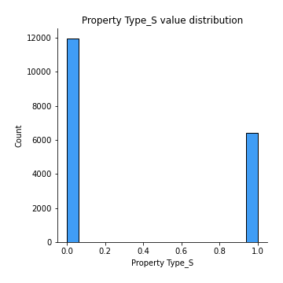

# Exploratory Data Analysis

[<< Go back](../README.md)
## Feature : target
- **Feature type** : continous
- **Missing** : 0.0%
- **Unique** : 1882
- **Count** :18386.0
- **Mean** :12.223350035899168
- **Std** :0.5946208571932523
- **Min** :5.857933154483459
- **25%th Percentile** : 11.918057184177155
- **50%th Percentile** : 12.206072645530174
- **75%th Percentile** : 12.568978139219542
- **Max** :14.721750953984929

## Feature : Postcode
- **Feature type** : continous
- **Missing** : 0.0%
- **Unique** : 22
- **Count** :18386.0
- **Mean** :230881.82184954948
- **Std** :60857.55991030847
- **Min** :112442.30168776371
- **25%th Percentile** : 173908.37175635074
- **50%th Percentile** : 218116.52584740217
- **75%th Percentile** : 273531.47222222225
- **Max** :400420.1380543634

## Feature : Add2
- **Feature type** : continous
- **Missing** : 0.0%
- **Unique** : 2577
- **Count** :18386.0
- **Mean** :231596.4044680671
- **Std** :109219.65218571383
- **Min** :64869.4999361854
- **25%th Percentile** : 164702.96875000233
- **50%th Percentile** : 208359.09092736445
- **75%th Percentile** : 272829.73333333334
- **Max** :1802012.3963399986

## Feature : Add3
- **Feature type** : continous
- **Missing** : 0.0%
- **Unique** : 82
- **Count** :18386.0
- **Mean** :229499.23353704333
- **Std** :75840.02516458202
- **Min** :90247.02762374967
- **25%th Percentile** : 169920.06271186442
- **50%th Percentile** : 210893.3156462585
- **75%th Percentile** : 278999.8531182278
- **Max** :1179038.6598404162

## Feature : District
- **Feature type** : continous
- **Missing** : 0.0%
- **Unique** : 6
- **Count** :18386.0
- **Mean** :232288.2980940341
- **Std** :20018.11394762622
- **Min** :161876.17884510927
- **25%th Percentile** : 230438.74957689867
- **50%th Percentile** : 230438.74957689867
- **75%th Percentile** : 230438.74957689867
- **Max** :515644.1695652174

## Feature : County
- **Feature type** : continous
- **Missing** : 0.0%
- **Unique** : 2
- **Count** :18386.0
- **Mean** :232644.99024037126
- **Std** :7328.229288783467
- **Min** :230437.21075996195
- **25%th Percentile** : 230437.21075996195
- **50%th Percentile** : 230437.21075996195
- **75%th Percentile** : 230437.21075996195
- **Max** :256968.0823454021

## Feature : Month
- **Feature type** : discrete
- **Missing** : 0.0%
- **Unique** : 12
- **Count** :18386.0
- **Mean** :6.946045904492549
- **Std** :3.3794277357930005
- **Min** :1.0
- **25%th Percentile** : 4.0
- **50%th Percentile** : 7.0
- **75%th Percentile** : 10.0
- **Max** :12.0

## Feature : Year
- **Feature type** : discrete
- **Missing** : 0.0%
- **Unique** : 3
- **Count** :18386.0
- **Mean** :2018.703524420755
- **Std** :0.8079329150296536
- **Min** :2018.0
- **25%th Percentile** : 2018.0
- **50%th Percentile** : 2018.0
- **75%th Percentile** : 2019.0
- **Max** :2020.0

## Feature : Property Type_D
- **Feature type** : discrete
- **Missing** : 0.0%
- **Unique** : 2
- **Count** :18386.0
- **Mean** :0.2411073642989231
- **Std** :0.42776694071073207
- **Min** :0.0
- **25%th Percentile** : 0.0
- **50%th Percentile** : 0.0
- **75%th Percentile** : 0.0
- **Max** :1.0

## Feature : Property Type_F
- **Feature type** : discrete
- **Missing** : 0.0%
- **Unique** : 2
- **Count** :18386.0
- **Mean** :0.10877841836179702
- **Std** :0.31136947047815633
- **Min** :0.0
- **25%th Percentile** : 0.0
- **50%th Percentile** : 0.0
- **75%th Percentile** : 0.0
- **Max** :1.0

## Feature : Property Type_O
- **Feature type** : discrete
- **Missing** : 0.0%
- **Unique** : 2
- **Count** :18386.0
- **Mean** :0.034102034156423364
- **Std** :0.18149621773213356
- **Min** :0.0
- **25%th Percentile** : 0.0
- **50%th Percentile** : 0.0
- **75%th Percentile** : 0.0
- **Max** :1.0

## Feature : Property Type_S
- **Feature type** : discrete
- **Missing** : 0.0%
- **Unique** : 2
- **Count** :18386.0
- **Mean** :0.3497770042423583
- **Std** :0.4769123841149867
- **Min** :0.0
- **25%th Percentile** : 0.0
- **50%th Percentile** : 0.0
- **75%th Percentile** : 1.0
- **Max** :1.0

## Feature : Property Type_T
- **Feature type** : discrete
- **Missing** : 0.0%
- **Unique** : 2
- **Count** :18386.0
- **Mean** :0.2662351789404982
- **Std** :0.4420007173783467
- **Min** :0.0
- **25%th Percentile** : 0.0
- **50%th Percentile** : 0.0
- **75%th Percentile** : 1.0
- **Max** :1.0

## Feature : Old/New_N
- **Feature type** : discrete
- **Missing** : 0.0%
- **Unique** : 2
- **Count** :18386.0
- **Mean** :0.8583704992929403
- **Std** :0.3486792189451034
- **Min** :0.0
- **25%th Percentile** : 1.0
- **50%th Percentile** : 1.0
- **75%th Percentile** : 1.0
- **Max** :1.0

## Feature : Old/New_Y
- **Feature type** : discrete
- **Missing** : 0.0%
- **Unique** : 2
- **Count** :18386.0
- **Mean** :0.1416295007070597
- **Std** :0.3486792189451034
- **Min** :0.0
- **25%th Percentile** : 0.0
- **50%th Percentile** : 0.0
- **75%th Percentile** : 0.0
- **Max** :1.0

## Feature : Duration_F
- **Feature type** : discrete
- **Missing** : 0.0%
- **Unique** : 2
- **Count** :18386.0
- **Mean** :0.8770259980419884
- **Std** :0.3284162953808556
- **Min** :0.0
- **25%th Percentile** : 1.0
- **50%th Percentile** : 1.0
- **75%th Percentile** : 1.0
- **Max** :1.0

## Feature : Duration_L
- **Feature type** : discrete
- **Missing** : 0.0%
- **Unique** : 2
- **Count** :18386.0
- **Mean** :0.12297400195801153
- **Std** :0.3284162953808556
- **Min** :0.0
- **25%th Percentile** : 0.0
- **50%th Percentile** : 0.0
- **75%th Percentile** : 0.0
- **Max** :1.0

## Feature : PPDCategory Type_A
- **Feature type** : discrete
- **Missing** : 0.0%
- **Unique** : 2
- **Count** :18386.0
- **Mean** :0.879473512455129
- **Std** :0.32558504097508567
- **Min** :0.0
- **25%th Percentile** : 1.0
- **50%th Percentile** : 1.0
- **75%th Percentile** : 1.0
- **Max** :1.0

## Feature : PPDCategory Type_B
- **Feature type** : discrete
- **Missing** : 0.0%
- **Unique** : 2
- **Count** :18386.0
- **Mean** :0.1205264875448711
- **Std** :0.32558504097508567
- **Min** :0.0
- **25%th Percentile** : 0.0
- **50%th Percentile** : 0.0
- **75%th Percentile** : 0.0
- **Max** :1.0

[<< Go back](../README.md)
