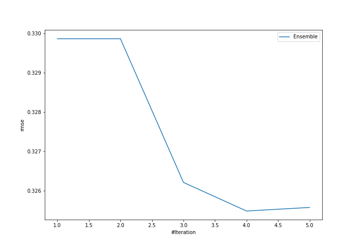
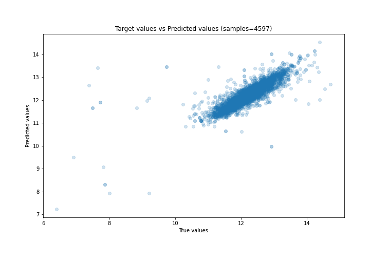
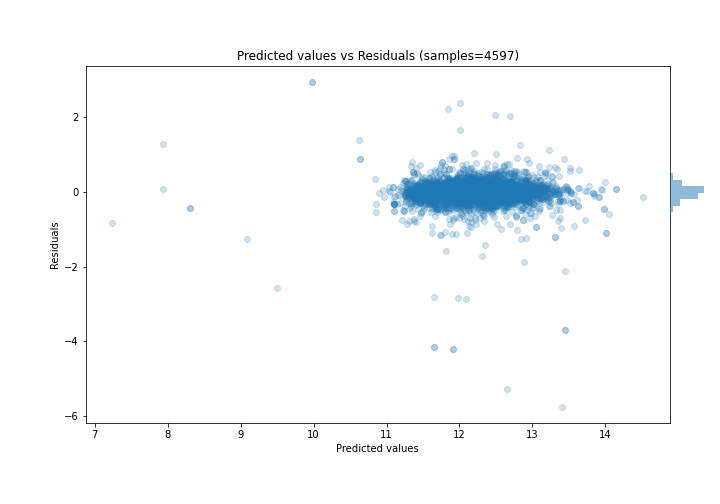

# Summary of Ensemble

[<< Go back](../README.md)

## Ensemble structure
| Model                   |   Weight |
|:------------------------|---------:|
| 3_Default_Xgboost       |        3 |
| 4_Default_NeuralNetwork |        1 |

### Metric details:
| Metric   |     Score |
|:---------|----------:|
| MAE      | 0.176059  |
| MSE      | 0.105944  |
| RMSE     | 0.32549   |
| R2       | 0.692767  |
| MAPE     | 0.0148888 |

## Learning curves

## True vs Predicted

## Predicted vs Residuals

[<< Go back](../README.md)
