# Exploratory Data Analysis

[<< Go back](../README.md)
## Feature : target
- **Feature type** : continous
- **Missing** : 0.0%
- **Unique** : 1963
- **Count** :19203.0
- **Mean** :12.200741221456498
- **Std** :0.5913792500977612
- **Min** :5.857933154483459
- **25%th Percentile** : 11.884489021402711
- **50%th Percentile** : 12.185869938212655
- **75%th Percentile** : 12.542544882151386
- **Max** :14.682366898199035

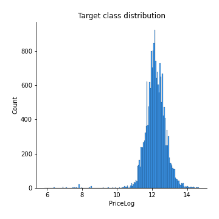
## Feature : Postcode
- **Feature type** : continous
- **Missing** : 0.0%
- **Unique** : 22
- **Count** :19203.0
- **Mean** :230855.91743097035
- **Std** :61116.81807216697
- **Min** :112442.30168776371
- **25%th Percentile** : 173908.37175635074
- **50%th Percentile** : 218116.52584740217
- **75%th Percentile** : 273531.47222222225
- **Max** :400420.1380543634

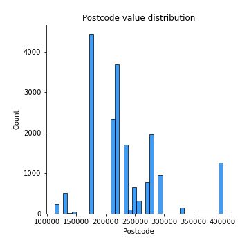
## Feature : Add2
- **Feature type** : continous
- **Missing** : 0.0%
- **Unique** : 2580
- **Count** :19203.0
- **Mean** :230912.3425898084
- **Std** :110016.56976561074
- **Min** :64869.4999361854
- **25%th Percentile** : 164046.7741935548
- **50%th Percentile** : 207632.85209282686
- **75%th Percentile** : 271307.33480115596
- **Max** :1802012.3963399986

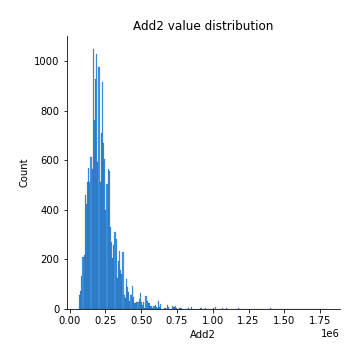
## Feature : Add3
- **Feature type** : continous
- **Missing** : 0.0%
- **Unique** : 84
- **Count** :19203.0
- **Mean** :230073.82507813655
- **Std** :76890.28876287438
- **Min** :90247.02762374967
- **25%th Percentile** : 173953.42537313432
- **50%th Percentile** : 210893.3156462585
- **75%th Percentile** : 278999.8531182278
- **Max** :1179038.6598404162

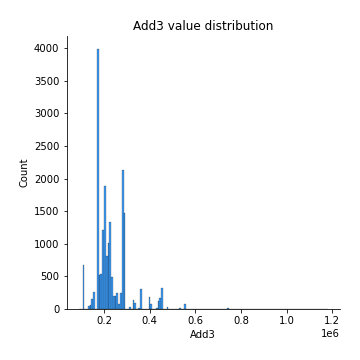
## Feature : District
- **Feature type** : continous
- **Missing** : 0.0%
- **Unique** : 6
- **Count** :19203.0
- **Mean** :232385.71305537818
- **Std** :20421.909673394966
- **Min** :161876.17884510927
- **25%th Percentile** : 230438.74957689867
- **50%th Percentile** : 230438.74957689867
- **75%th Percentile** : 230438.74957689867
- **Max** :515644.1695652174

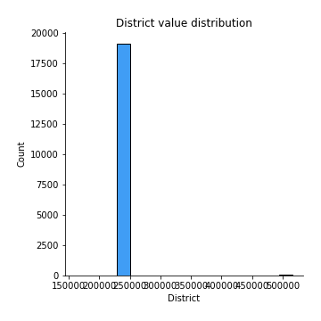
## Feature : County
- **Feature type** : continous
- **Missing** : 0.0%
- **Unique** : 2
- **Count** :19203.0
- **Mean** :232770.73375683505
- **Std** :7514.519943162266
- **Min** :230437.21075996195
- **25%th Percentile** : 230437.21075996195
- **50%th Percentile** : 230437.21075996195
- **75%th Percentile** : 230437.21075996195
- **Max** :256968.0823454021

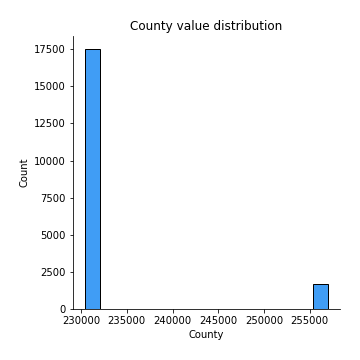
## Feature : Month
- **Feature type** : discrete
- **Missing** : 0.0%
- **Unique** : 12
- **Count** :19203.0
- **Mean** :6.833411446128209
- **Std** :3.3443337814322764
- **Min** :1.0
- **25%th Percentile** : 4.0
- **50%th Percentile** : 7.0
- **75%th Percentile** : 10.0
- **Max** :12.0

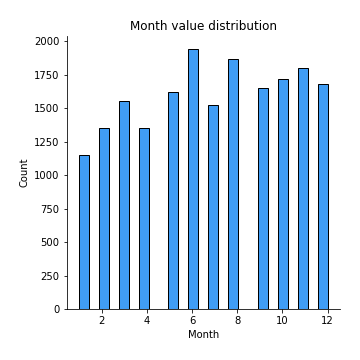
## Feature : Year
- **Feature type** : discrete
- **Missing** : 0.0%
- **Unique** : 3
- **Count** :19203.0
- **Mean** :2017.9931781492476
- **Std** :0.709573645022215
- **Min** :2017.0
- **25%th Percentile** : 2017.0
- **50%th Percentile** : 2018.0
- **75%th Percentile** : 2018.0
- **Max** :2019.0

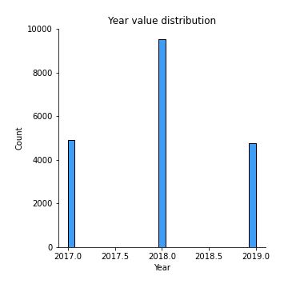
## Feature : Property Type_D
- **Feature type** : discrete
- **Missing** : 0.0%
- **Unique** : 2
- **Count** :19203.0
- **Mean** :0.24480549914075925
- **Std** :0.4299830167279589
- **Min** :0.0
- **25%th Percentile** : 0.0
- **50%th Percentile** : 0.0
- **75%th Percentile** : 0.0
- **Max** :1.0

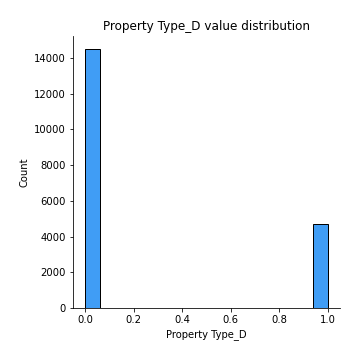
## Feature : Property Type_F
- **Feature type** : discrete
- **Missing** : 0.0%
- **Unique** : 2
- **Count** :19203.0
- **Mean** :0.10586887465500182
- **Std** :0.30767773036616364
- **Min** :0.0
- **25%th Percentile** : 0.0
- **50%th Percentile** : 0.0
- **75%th Percentile** : 0.0
- **Max** :1.0

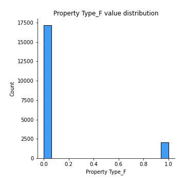
## Feature : Property Type_O
- **Feature type** : discrete
- **Missing** : 0.0%
- **Unique** : 2
- **Count** :19203.0
- **Mean** :0.03520283289069416
- **Std** :0.18429694028951657
- **Min** :0.0
- **25%th Percentile** : 0.0
- **50%th Percentile** : 0.0
- **75%th Percentile** : 0.0
- **Max** :1.0

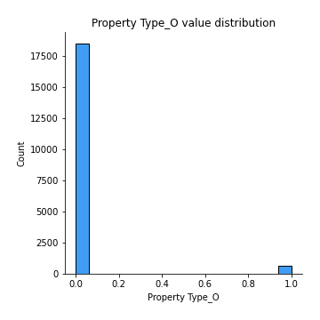
## Feature : Property Type_S
- **Feature type** : discrete
- **Missing** : 0.0%
- **Unique** : 2
- **Count** :19203.0
- **Mean** :0.3457272301202937
- **Std** :0.4756171700979679
- **Min** :0.0
- **25%th Percentile** : 0.0
- **50%th Percentile** : 0.0
- **75%th Percentile** : 1.0
- **Max** :1.0

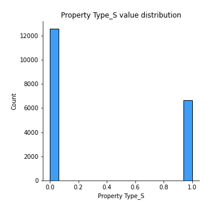
## Feature : Property Type_T
- **Feature type** : discrete
- **Missing** : 0.0%
- **Unique** : 2
- **Count** :19203.0
- **Mean** :0.26839556319325103
- **Std** :0.4431361087042175
- **Min** :0.0
- **25%th Percentile** : 0.0
- **50%th Percentile** : 0.0
- **75%th Percentile** : 1.0
- **Max** :1.0

## Feature : Old/New_N
- **Feature type** : discrete
- **Missing** : 0.0%
- **Unique** : 2
- **Count** :19203.0
- **Mean** :0.8684580534291517
- **Std** :0.33800090558138746
- **Min** :0.0
- **25%th Percentile** : 1.0
- **50%th Percentile** : 1.0
- **75%th Percentile** : 1.0
- **Max** :1.0

## Feature : Old/New_Y
- **Feature type** : discrete
- **Missing** : 0.0%
- **Unique** : 2
- **Count** :19203.0
- **Mean** :0.1315419465708483
- **Std** :0.33800090558138746
- **Min** :0.0
- **25%th Percentile** : 0.0
- **50%th Percentile** : 0.0
- **75%th Percentile** : 0.0
- **Max** :1.0

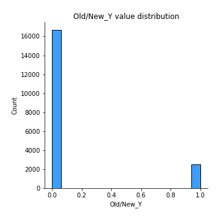
## Feature : Duration_F
- **Feature type** : discrete
- **Missing** : 0.0%
- **Unique** : 2
- **Count** :19203.0
- **Mean** :0.8780398896005832
- **Std** :0.3272482523673104
- **Min** :0.0
- **25%th Percentile** : 1.0
- **50%th Percentile** : 1.0
- **75%th Percentile** : 1.0
- **Max** :1.0

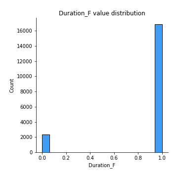
## Feature : Duration_L
- **Feature type** : discrete
- **Missing** : 0.0%
- **Unique** : 2
- **Count** :19203.0
- **Mean** :0.12196011039941676
- **Std** :0.3272482523673104
- **Min** :0.0
- **25%th Percentile** : 0.0
- **50%th Percentile** : 0.0
- **75%th Percentile** : 0.0
- **Max** :1.0

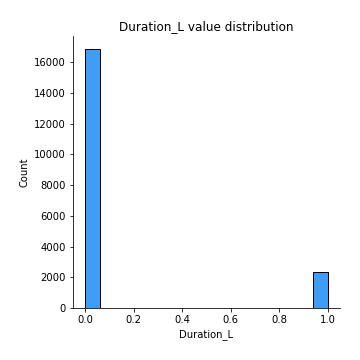
## Feature : PPDCategory Type_A
- **Feature type** : discrete
- **Missing** : 0.0%
- **Unique** : 2
- **Count** :19203.0
- **Mean** :0.8827266572931313
- **Std** :0.3217540938640013
- **Min** :0.0
- **25%th Percentile** : 1.0
- **50%th Percentile** : 1.0
- **75%th Percentile** : 1.0
- **Max** :1.0

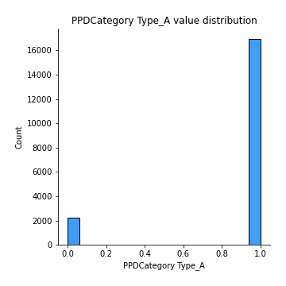
## Feature : PPDCategory Type_B
- **Feature type** : discrete
- **Missing** : 0.0%
- **Unique** : 2
- **Count** :19203.0
- **Mean** :0.11727334270686872
- **Std** :0.3217540938640013
- **Min** :0.0
- **25%th Percentile** : 0.0
- **50%th Percentile** : 0.0
- **75%th Percentile** : 0.0
- **Max** :1.0

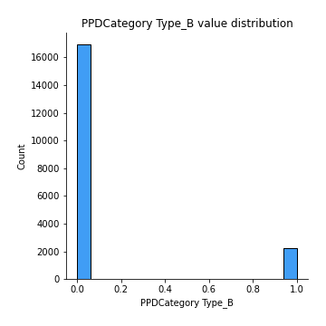

[<< Go back](../README.md)
