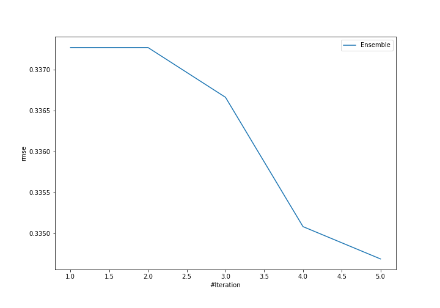
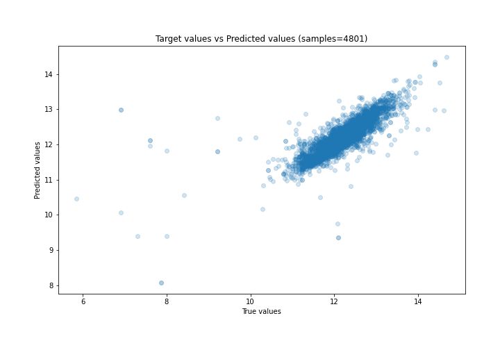
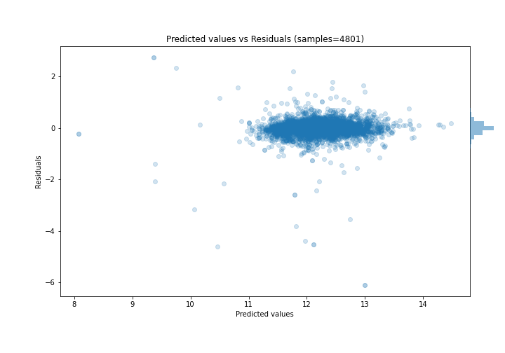

# Summary of Ensemble

[<< Go back](../README.md)

## Ensemble structure
| Model                  |   Weight |
|:-----------------------|---------:|
| 3_Default_Xgboost      |        4 |
| 5_Default_RandomForest |        1 |

### Metric details:
| Metric   |     Score |
|:---------|----------:|
| MAE      | 0.183066  |
| MSE      | 0.112014  |
| RMSE     | 0.334686  |
| R2       | 0.669891  |
| MAPE     | 0.0156216 |

## Learning curves

## True vs Predicted

## Predicted vs Residuals

[<< Go back](../README.md)
