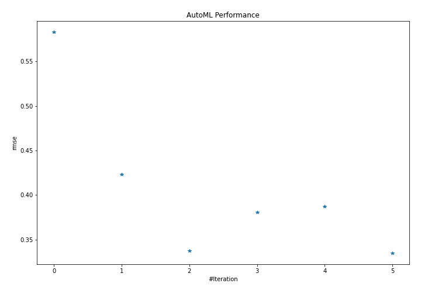
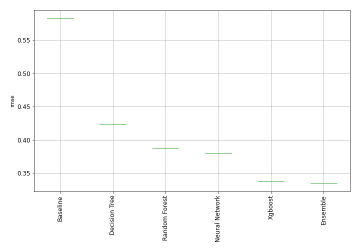
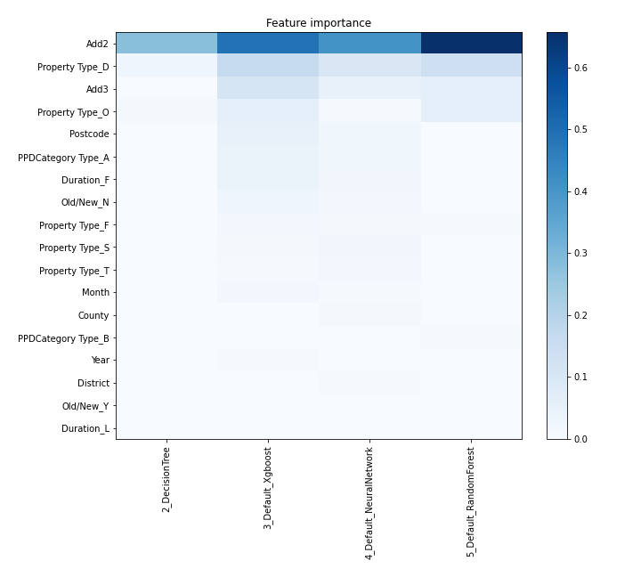
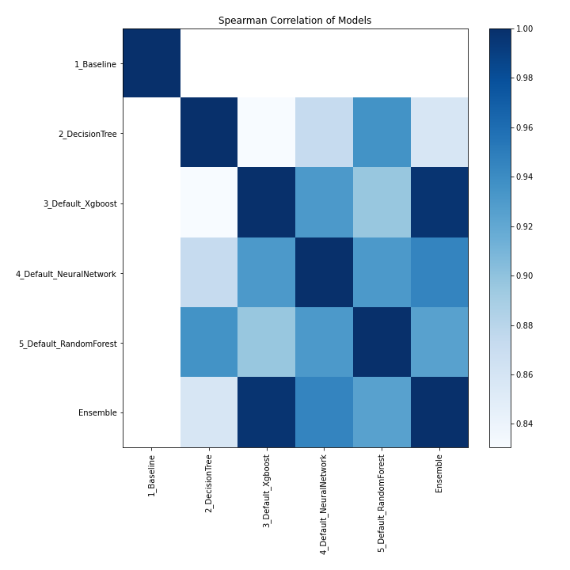

# AutoML Leaderboard

| Best model   | name                                                         | model_type     | metric_type   |   metric_value |   train_time |
|:-------------|:-------------------------------------------------------------|:---------------|:--------------|---------------:|-------------:|
|              | [1_Baseline](1_Baseline/README.md)                           | Baseline       | rmse          |       0.582922 |         1.65 |
|              | [2_DecisionTree](2_DecisionTree/README.md)                   | Decision Tree  | rmse          |       0.422985 |         7.79 |
|              | [3_Default_Xgboost](3_Default_Xgboost/README.md)             | Xgboost        | rmse          |       0.337268 |        15.87 |
|              | [4_Default_NeuralNetwork](4_Default_NeuralNetwork/README.md) | Neural Network | rmse          |       0.38027  |         3.21 |
|              | [5_Default_RandomForest](5_Default_RandomForest/README.md)   | Random Forest  | rmse          |       0.386989 |         5.89 |
| **the best** | [Ensemble](Ensemble/README.md)                               | Ensemble       | rmse          |       0.334686 |         0.36 |

### AutoML Performance

### AutoML Performance Boxplot

### Features Importance

### Spearman Correlation of Models

