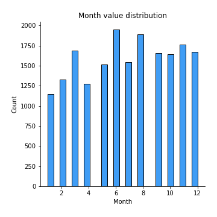

# Exploratory Data Analysis

[<< Go back](../README.md)
## Feature : target
- **Feature type** : continous
- **Missing** : 0.0%
- **Unique** : 1991
- **Count** :19085.0
- **Mean** :12.185650014152197
- **Std** :0.5923272500552141
- **Min** :4.605170185988092
- **25%th Percentile** : 11.84939770159144
- **50%th Percentile** : 12.167851432709975
- **75%th Percentile** : 12.531772785169476
- **Max** :14.690979295318174

## Feature : Postcode
- **Feature type** : continous
- **Missing** : 0.0%
- **Unique** : 23
- **Count** :19085.0
- **Mean** :231899.69765559054
- **Std** :61392.07839872299
- **Min** :112442.30168776371
- **25%th Percentile** : 173908.37175635074
- **50%th Percentile** : 218116.52584740217
- **75%th Percentile** : 273531.47222222225
- **Max** :400420.1380543634

## Feature : Add2
- **Feature type** : continous
- **Missing** : 0.0%
- **Unique** : 2560
- **Count** :19085.0
- **Mean** :231653.17799481924
- **Std** :111656.61459409166
- **Min** :37070.212141204334
- **25%th Percentile** : 163660.087213999
- **50%th Percentile** : 207850.70776570486
- **75%th Percentile** : 272978.8461532834
- **Max** :1802012.3963399986

## Feature : Add3
- **Feature type** : continous
- **Missing** : 0.0%
- **Unique** : 83
- **Count** :19085.0
- **Mean** :231880.4324877005
- **Std** :77391.42528313202
- **Min** :90247.02762374967
- **25%th Percentile** : 173953.42537313432
- **50%th Percentile** : 213710.79976303317
- **75%th Percentile** : 278999.8531182278
- **Max** :1179038.6598404162

## Feature : District
- **Feature type** : continous
- **Missing** : 0.0%
- **Unique** : 6
- **Count** :19085.0
- **Mean** :232454.92567856348
- **Std** :20877.779169604866
- **Min** :161876.17884510927
- **25%th Percentile** : 230438.74957689867
- **50%th Percentile** : 230438.74957689867
- **75%th Percentile** : 230438.74957689867
- **Max** :515644.1695652174

## Feature : County
- **Feature type** : continous
- **Missing** : 0.0%
- **Unique** : 2
- **Count** :19085.0
- **Mean** :232747.62776683332
- **Std** :7480.794238342579
- **Min** :230437.21075996195
- **25%th Percentile** : 230437.21075996195
- **50%th Percentile** : 230437.21075996195
- **75%th Percentile** : 230437.21075996195
- **Max** :256968.0823454021

## Feature : Month
- **Feature type** : discrete
- **Missing** : 0.0%
- **Unique** : 12
- **Count** :19085.0
- **Mean** :6.817972229499607
- **Std** :3.347194612744415
- **Min** :1.0
- **25%th Percentile** : 4.0
- **50%th Percentile** : 7.0
- **75%th Percentile** : 10.0
- **Max** :12.0

## Feature : Year
- **Feature type** : discrete
- **Missing** : 0.0%
- **Unique** : 3
- **Count** :19085.0
- **Mean** :2017.2558553838094
- **Std** :0.8233027408584802
- **Min** :2016.0
- **25%th Percentile** : 2017.0
- **50%th Percentile** : 2017.0
- **75%th Percentile** : 2018.0
- **Max** :2018.0

## Feature : Property Type_D
- **Feature type** : discrete
- **Missing** : 0.0%
- **Unique** : 2
- **Count** :19085.0
- **Mean** :0.25229237621168454
- **Std** :0.43433951913937796
- **Min** :0.0
- **25%th Percentile** : 0.0
- **50%th Percentile** : 0.0
- **75%th Percentile** : 1.0
- **Max** :1.0

## Feature : Property Type_F
- **Feature type** : discrete
- **Missing** : 0.0%
- **Unique** : 2
- **Count** :19085.0
- **Mean** :0.10201729106628242
- **Std** :0.30267897801747135
- **Min** :0.0
- **25%th Percentile** : 0.0
- **50%th Percentile** : 0.0
- **75%th Percentile** : 0.0
- **Max** :1.0

## Feature : Property Type_O
- **Feature type** : discrete
- **Missing** : 0.0%
- **Unique** : 2
- **Count** :19085.0
- **Mean** :0.034372543882630335
- **Std** :0.18218894400885802
- **Min** :0.0
- **25%th Percentile** : 0.0
- **50%th Percentile** : 0.0
- **75%th Percentile** : 0.0
- **Max** :1.0

## Feature : Property Type_S
- **Feature type** : discrete
- **Missing** : 0.0%
- **Unique** : 2
- **Count** :19085.0
- **Mean** :0.33749017553052135
- **Std** :0.472866020218558
- **Min** :0.0
- **25%th Percentile** : 0.0
- **50%th Percentile** : 0.0
- **75%th Percentile** : 1.0
- **Max** :1.0

## Feature : Property Type_T
- **Feature type** : discrete
- **Missing** : 0.0%
- **Unique** : 2
- **Count** :19085.0
- **Mean** :0.27382761330888133
- **Std** :0.44593325847582893
- **Min** :0.0
- **25%th Percentile** : 0.0
- **50%th Percentile** : 0.0
- **75%th Percentile** : 1.0
- **Max** :1.0

## Feature : Old/New_N
- **Feature type** : discrete
- **Missing** : 0.0%
- **Unique** : 2
- **Count** :19085.0
- **Mean** :0.8770238407126015
- **Std** :0.32841844501140566
- **Min** :0.0
- **25%th Percentile** : 1.0
- **50%th Percentile** : 1.0
- **75%th Percentile** : 1.0
- **Max** :1.0

## Feature : Old/New_Y
- **Feature type** : discrete
- **Missing** : 0.0%
- **Unique** : 2
- **Count** :19085.0
- **Mean** :0.12297615928739848
- **Std** :0.32841844501140566
- **Min** :0.0
- **25%th Percentile** : 0.0
- **50%th Percentile** : 0.0
- **75%th Percentile** : 0.0
- **Max** :1.0

## Feature : Duration_F
- **Feature type** : discrete
- **Missing** : 0.0%
- **Unique** : 2
- **Count** :19085.0
- **Mean** :0.881896777574011
- **Std** :0.3227387627541214
- **Min** :0.0
- **25%th Percentile** : 1.0
- **50%th Percentile** : 1.0
- **75%th Percentile** : 1.0
- **Max** :1.0

## Feature : Duration_L
- **Feature type** : discrete
- **Missing** : 0.0%
- **Unique** : 2
- **Count** :19085.0
- **Mean** :0.118103222425989
- **Std** :0.3227387627541214
- **Min** :0.0
- **25%th Percentile** : 0.0
- **50%th Percentile** : 0.0
- **75%th Percentile** : 0.0
- **Max** :1.0

## Feature : PPDCategory Type_A
- **Feature type** : discrete
- **Missing** : 0.0%
- **Unique** : 2
- **Count** :19085.0
- **Mean** :0.890385119203563
- **Std** :0.3124173057112446
- **Min** :0.0
- **25%th Percentile** : 1.0
- **50%th Percentile** : 1.0
- **75%th Percentile** : 1.0
- **Max** :1.0

## Feature : PPDCategory Type_B
- **Feature type** : discrete
- **Missing** : 0.0%
- **Unique** : 2
- **Count** :19085.0
- **Mean** :0.109614880796437
- **Std** :0.3124173057112446
- **Min** :0.0
- **25%th Percentile** : 0.0
- **50%th Percentile** : 0.0
- **75%th Percentile** : 0.0
- **Max** :1.0

[<< Go back](../README.md)
