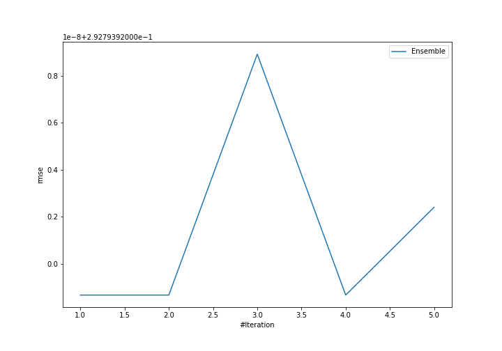
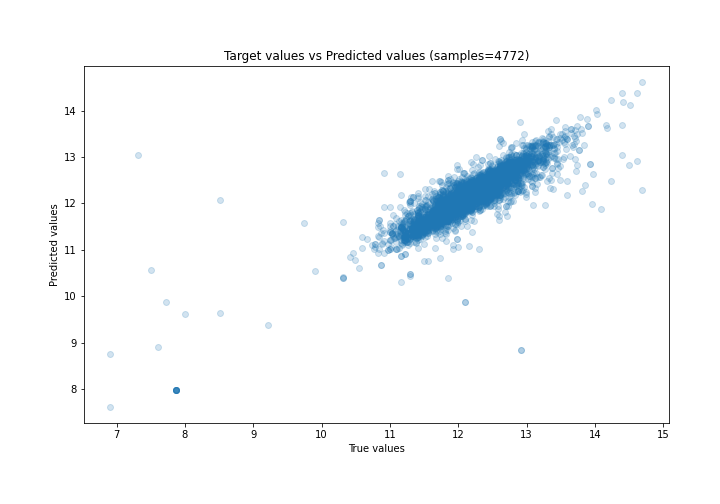
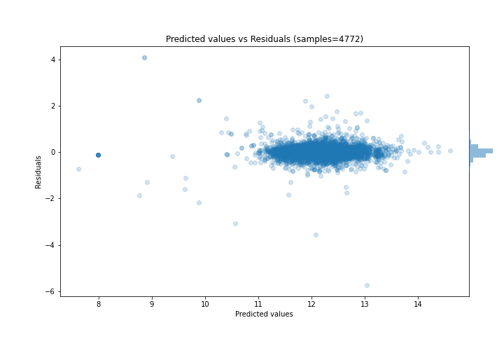

# Summary of Ensemble

[<< Go back](../README.md)

## Ensemble structure
| Model             |   Weight |
|:------------------|---------:|
| 3_Default_Xgboost |        1 |

### Metric details:
| Metric   |     Score |
|:---------|----------:|
| MAE      | 0.176698  |
| MSE      | 0.0857283 |
| RMSE     | 0.292794  |
| R2       | 0.76348   |
| MAPE     | 0.0147036 |

## Learning curves

## True vs Predicted

## Predicted vs Residuals

[<< Go back](../README.md)
