# Exploratory Data Analysis

[<< Go back](../README.md)
## Feature : target
- **Feature type** : continous
- **Missing** : 0.0%
- **Unique** : 1975
- **Count** :14022.0
- **Mean** :12.147341721314248
- **Std** :0.5622405590470243
- **Min** :4.605170185988092
- **25%th Percentile** : 11.794337924408413
- **50%th Percentile** : 12.111761966058932
- **75%th Percentile** : 12.487485104968359
- **Max** :14.690979295318174

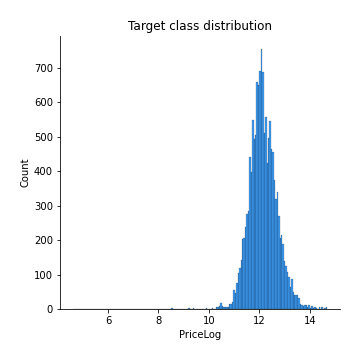
## Feature : Postcode
- **Feature type** : continous
- **Missing** : 0.0%
- **Unique** : 23
- **Count** :14022.0
- **Mean** :233715.87267567677
- **Std** :62509.3860672891
- **Min** :112442.30168776371
- **25%th Percentile** : 173908.37175635074
- **50%th Percentile** : 218116.52584740217
- **75%th Percentile** : 273531.47222222225
- **Max** :400420.1380543634

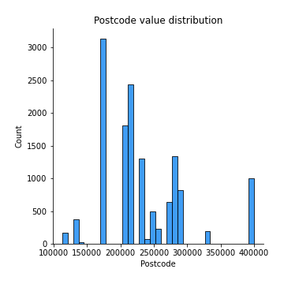
## Feature : Add2
- **Feature type** : continous
- **Missing** : 0.0%
- **Unique** : 2492
- **Count** :14022.0
- **Mean** :230503.54464045147
- **Std** :111816.74193047255
- **Min** :37070.212141204334
- **25%th Percentile** : 162408.661971831
- **50%th Percentile** : 206196.2601048224
- **75%th Percentile** : 270379.65748031496
- **Max** :1817058.3129467827

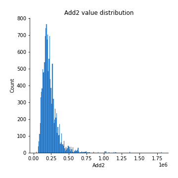
## Feature : Add3
- **Feature type** : continous
- **Missing** : 0.0%
- **Unique** : 84
- **Count** :14022.0
- **Mean** :234029.61686080994
- **Std** :78122.09340948118
- **Min** :90247.02762374967
- **25%th Percentile** : 173953.42537313432
- **50%th Percentile** : 213710.79976303317
- **75%th Percentile** : 278999.8531182278
- **Max** :749903.1515704548

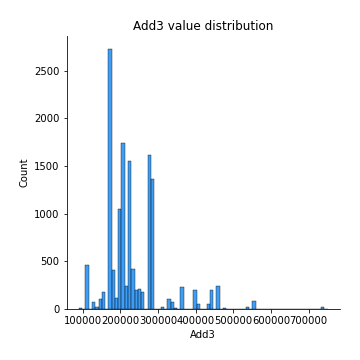
## Feature : District
- **Feature type** : continous
- **Missing** : 0.0%
- **Unique** : 6
- **Count** :14022.0
- **Mean** :232644.10406305513
- **Std** :22573.92569770104
- **Min** :161876.17884510927
- **25%th Percentile** : 230438.74957689867
- **50%th Percentile** : 230438.74957689867
- **75%th Percentile** : 230438.74957689867
- **Max** :515644.1695652174

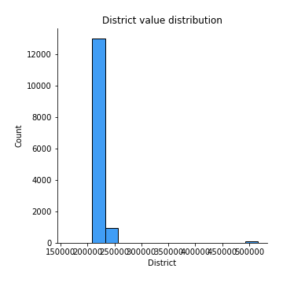
## Feature : County
- **Feature type** : continous
- **Missing** : 0.0%
- **Unique** : 2
- **Count** :14022.0
- **Mean** :232397.4149364672
- **Std** :6940.242068755398
- **Min** :230437.21075996195
- **25%th Percentile** : 230437.21075996195
- **50%th Percentile** : 230437.21075996195
- **75%th Percentile** : 230437.21075996195
- **Max** :256968.0823454021

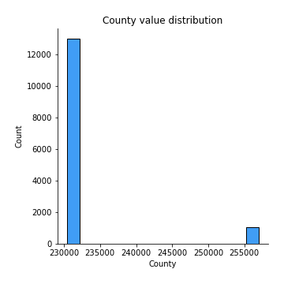
## Feature : Month
- **Feature type** : discrete
- **Missing** : 0.0%
- **Unique** : 12
- **Count** :14022.0
- **Mean** :6.8358294109256885
- **Std** :3.3536535776593364
- **Min** :1.0
- **25%th Percentile** : 4.0
- **50%th Percentile** : 7.0
- **75%th Percentile** : 10.0
- **Max** :12.0

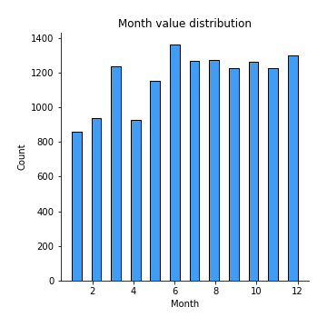
## Feature : Year
- **Feature type** : discrete
- **Missing** : 0.0%
- **Unique** : 3
- **Count** :14022.0
- **Mean** :2016.030594779632
- **Std** :0.8169568554337254
- **Min** :2015.0
- **25%th Percentile** : 2015.0
- **50%th Percentile** : 2016.0
- **75%th Percentile** : 2017.0
- **Max** :2017.0

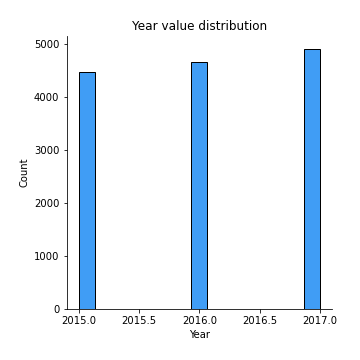
## Feature : Property Type_D
- **Feature type** : discrete
- **Missing** : 0.0%
- **Unique** : 2
- **Count** :14022.0
- **Mean** :0.2540293823990871
- **Std** :0.4353297263086653
- **Min** :0.0
- **25%th Percentile** : 0.0
- **50%th Percentile** : 0.0
- **75%th Percentile** : 1.0
- **Max** :1.0

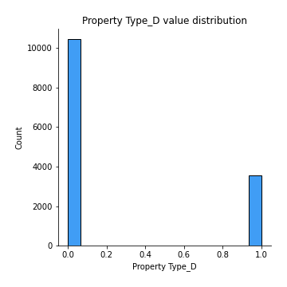
## Feature : Property Type_F
- **Feature type** : discrete
- **Missing** : 0.0%
- **Unique** : 2
- **Count** :14022.0
- **Mean** :0.09927257167308515
- **Std** :0.2990383012035349
- **Min** :0.0
- **25%th Percentile** : 0.0
- **50%th Percentile** : 0.0
- **75%th Percentile** : 0.0
- **Max** :1.0

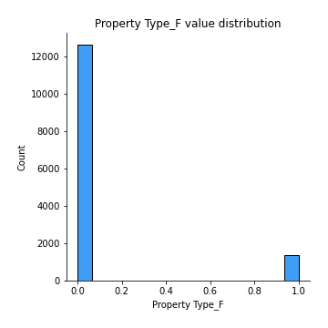
## Feature : Property Type_O
- **Feature type** : discrete
- **Missing** : 0.0%
- **Unique** : 2
- **Count** :14022.0
- **Mean** :0.02374839537869063
- **Std** :0.15226970363314493
- **Min** :0.0
- **25%th Percentile** : 0.0
- **50%th Percentile** : 0.0
- **75%th Percentile** : 0.0
- **Max** :1.0

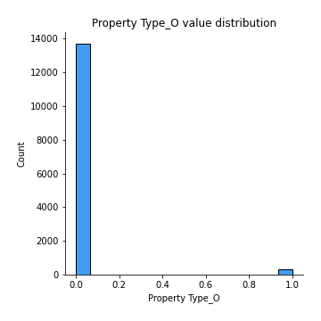
## Feature : Property Type_S
- **Feature type** : discrete
- **Missing** : 0.0%
- **Unique** : 2
- **Count** :14022.0
- **Mean** :0.33411781486235914
- **Std** :0.4716979632161197
- **Min** :0.0
- **25%th Percentile** : 0.0
- **50%th Percentile** : 0.0
- **75%th Percentile** : 1.0
- **Max** :1.0

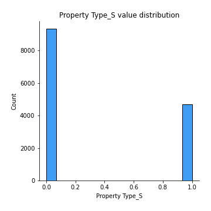
## Feature : Property Type_T
- **Feature type** : discrete
- **Missing** : 0.0%
- **Unique** : 2
- **Count** :14022.0
- **Mean** :0.2888318356867779
- **Std** :0.4532357624967404
- **Min** :0.0
- **25%th Percentile** : 0.0
- **50%th Percentile** : 0.0
- **75%th Percentile** : 1.0
- **Max** :1.0

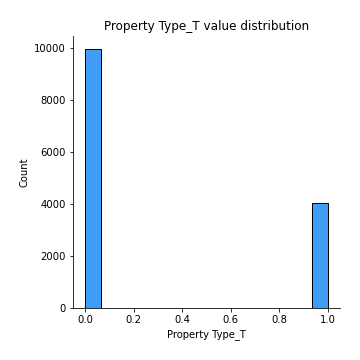
## Feature : Old/New_N
- **Feature type** : discrete
- **Missing** : 0.0%
- **Unique** : 2
- **Count** :14022.0
- **Mean** :0.8734845243189274
- **Std** :0.33244126066700075
- **Min** :0.0
- **25%th Percentile** : 1.0
- **50%th Percentile** : 1.0
- **75%th Percentile** : 1.0
- **Max** :1.0

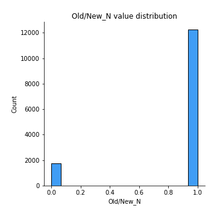
## Feature : Old/New_Y
- **Feature type** : discrete
- **Missing** : 0.0%
- **Unique** : 2
- **Count** :14022.0
- **Mean** :0.1265154756810726
- **Std** :0.33244126066700075
- **Min** :0.0
- **25%th Percentile** : 0.0
- **50%th Percentile** : 0.0
- **75%th Percentile** : 0.0
- **Max** :1.0

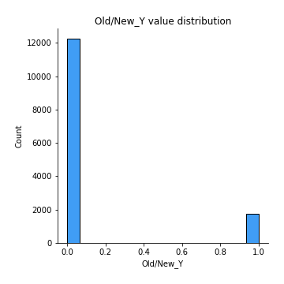
## Feature : Duration_F
- **Feature type** : discrete
- **Missing** : 0.0%
- **Unique** : 2
- **Count** :14022.0
- **Mean** :0.8853230637569534
- **Std** :0.31864302525293453
- **Min** :0.0
- **25%th Percentile** : 1.0
- **50%th Percentile** : 1.0
- **75%th Percentile** : 1.0
- **Max** :1.0

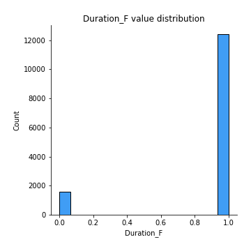
## Feature : Duration_L
- **Feature type** : discrete
- **Missing** : 0.0%
- **Unique** : 2
- **Count** :14022.0
- **Mean** :0.11467693624304665
- **Std** :0.31864302525293453
- **Min** :0.0
- **25%th Percentile** : 0.0
- **50%th Percentile** : 0.0
- **75%th Percentile** : 0.0
- **Max** :1.0

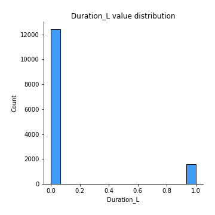
## Feature : PPDCategory Type_A
- **Feature type** : discrete
- **Missing** : 0.0%
- **Unique** : 2
- **Count** :14022.0
- **Mean** :0.9077164455855085
- **Std** :0.2894361318427004
- **Min** :0.0
- **25%th Percentile** : 1.0
- **50%th Percentile** : 1.0
- **75%th Percentile** : 1.0
- **Max** :1.0

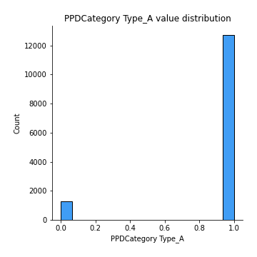
## Feature : PPDCategory Type_B
- **Feature type** : discrete
- **Missing** : 0.0%
- **Unique** : 2
- **Count** :14022.0
- **Mean** :0.09228355441449151
- **Std** :0.2894361318427004
- **Min** :0.0
- **25%th Percentile** : 0.0
- **50%th Percentile** : 0.0
- **75%th Percentile** : 0.0
- **Max** :1.0

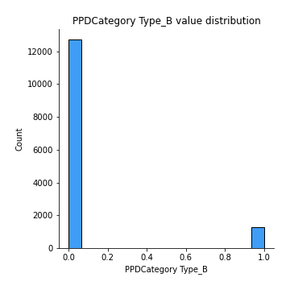

[<< Go back](../README.md)
