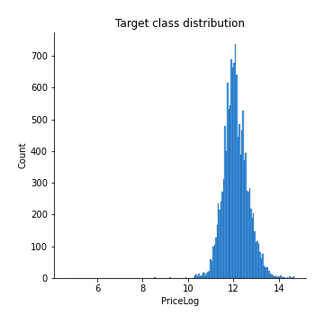
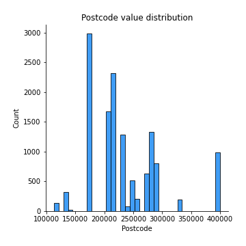
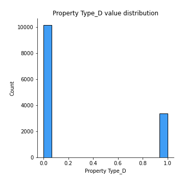
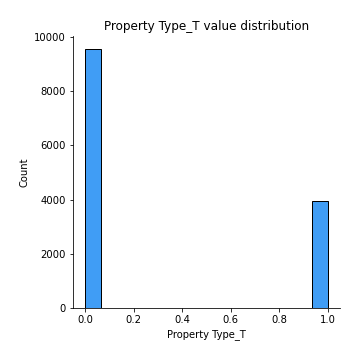

# Exploratory Data Analysis

[<< Go back](../README.md)
## Feature : target
- **Feature type** : continous
- **Missing** : 0.0%
- **Unique** : 1878
- **Count** :13516.0
- **Mean** :12.09909027444747
- **Std** :0.5566728664096405
- **Min** :4.605170185988092
- **25%th Percentile** : 11.744037185933616
- **50%th Percentile** : 12.061046873479915
- **75%th Percentile** : 12.429216196844383
- **Max** :14.690979295318174

## Feature : Postcode
- **Feature type** : continous
- **Missing** : 0.0%
- **Unique** : 22
- **Count** :13516.0
- **Mean** :235081.26335980886
- **Std** :62577.52312146098
- **Min** :112442.30168776371
- **25%th Percentile** : 173908.37175635074
- **50%th Percentile** : 218116.52584740217
- **75%th Percentile** : 273531.47222222225
- **Max** :400420.1380543634

## Feature : Add2
- **Feature type** : continous
- **Missing** : 0.0%
- **Unique** : 2426
- **Count** :13516.0
- **Mean** :229647.50470026777
- **Std** :113301.25326471099
- **Min** :37070.212141204334
- **25%th Percentile** : 161426.0718305039
- **50%th Percentile** : 202964.35238081554
- **75%th Percentile** : 270379.65748031496
- **Max** :1817058.3129467827

## Feature : Add3
- **Feature type** : continous
- **Missing** : 0.0%
- **Unique** : 82
- **Count** :13516.0
- **Mean** :235653.95619313786
- **Std** :78059.32787957838
- **Min** :90247.02762374967
- **25%th Percentile** : 178467.62368421053
- **50%th Percentile** : 222618.59002535927
- **75%th Percentile** : 278999.8531182278
- **Max** :740768.95

## Feature : District
- **Feature type** : continous
- **Missing** : 0.0%
- **Unique** : 6
- **Count** :13516.0
- **Mean** :232674.90361854705
- **Std** :23122.915208712828
- **Min** :161876.17884510927
- **25%th Percentile** : 230438.74957689867
- **50%th Percentile** : 230438.74957689867
- **75%th Percentile** : 230438.74957689867
- **Max** :515644.1695652174

## Feature : County
- **Feature type** : continous
- **Missing** : 0.0%
- **Unique** : 2
- **Count** :13516.0
- **Mean** :232170.4720510464
- **Std** :6556.21218835993
- **Min** :230437.21075996195
- **25%th Percentile** : 230437.21075996195
- **50%th Percentile** : 230437.21075996195
- **75%th Percentile** : 230437.21075996195
- **Max** :256968.0823454021

## Feature : Month
- **Feature type** : discrete
- **Missing** : 0.0%
- **Unique** : 12
- **Count** :13516.0
- **Mean** :6.779594554601953
- **Std** :3.344322383838304
- **Min** :1.0
- **25%th Percentile** : 4.0
- **50%th Percentile** : 7.0
- **75%th Percentile** : 10.0
- **Max** :12.0

## Feature : Year
- **Feature type** : discrete
- **Missing** : 0.0%
- **Unique** : 3
- **Count** :13516.0
- **Mean** :2015.0190145013319
- **Std** :0.8178598925152992
- **Min** :2014.0
- **25%th Percentile** : 2014.0
- **50%th Percentile** : 2015.0
- **75%th Percentile** : 2016.0
- **Max** :2016.0

## Feature : Property Type_D
- **Feature type** : discrete
- **Missing** : 0.0%
- **Unique** : 2
- **Count** :13516.0
- **Mean** :0.24844628588339746
- **Std** :0.4321279263462877
- **Min** :0.0
- **25%th Percentile** : 0.0
- **50%th Percentile** : 0.0
- **75%th Percentile** : 0.0
- **Max** :1.0

## Feature : Property Type_F
- **Feature type** : discrete
- **Missing** : 0.0%
- **Unique** : 2
- **Count** :13516.0
- **Mean** :0.10291506362829239
- **Std** :0.3038591524015535
- **Min** :0.0
- **25%th Percentile** : 0.0
- **50%th Percentile** : 0.0
- **75%th Percentile** : 0.0
- **Max** :1.0

## Feature : Property Type_O
- **Feature type** : discrete
- **Missing** : 0.0%
- **Unique** : 2
- **Count** :13516.0
- **Mean** :0.015389168393015686
- **Std** :0.1230994030820637
- **Min** :0.0
- **25%th Percentile** : 0.0
- **50%th Percentile** : 0.0
- **75%th Percentile** : 0.0
- **Max** :1.0

## Feature : Property Type_S
- **Feature type** : discrete
- **Missing** : 0.0%
- **Unique** : 2
- **Count** :13516.0
- **Mean** :0.34033737792246227
- **Std** :0.4738401195178799
- **Min** :0.0
- **25%th Percentile** : 0.0
- **50%th Percentile** : 0.0
- **75%th Percentile** : 1.0
- **Max** :1.0

## Feature : Property Type_T
- **Feature type** : discrete
- **Missing** : 0.0%
- **Unique** : 2
- **Count** :13516.0
- **Mean** :0.2929121041728322
- **Std** :0.45511529110413373
- **Min** :0.0
- **25%th Percentile** : 0.0
- **50%th Percentile** : 0.0
- **75%th Percentile** : 1.0
- **Max** :1.0

## Feature : Old/New_N
- **Feature type** : discrete
- **Missing** : 0.0%
- **Unique** : 2
- **Count** :13516.0
- **Mean** :0.8672684226102397
- **Std** :0.33929695437107593
- **Min** :0.0
- **25%th Percentile** : 1.0
- **50%th Percentile** : 1.0
- **75%th Percentile** : 1.0
- **Max** :1.0

## Feature : Old/New_Y
- **Feature type** : discrete
- **Missing** : 0.0%
- **Unique** : 2
- **Count** :13516.0
- **Mean** :0.1327315773897603
- **Std** :0.33929695437107593
- **Min** :0.0
- **25%th Percentile** : 0.0
- **50%th Percentile** : 0.0
- **75%th Percentile** : 0.0
- **Max** :1.0

## Feature : Duration_F
- **Feature type** : discrete
- **Missing** : 0.0%
- **Unique** : 2
- **Count** :13516.0
- **Mean** :0.8849511689849068
- **Std** :0.31909266804598496
- **Min** :0.0
- **25%th Percentile** : 1.0
- **50%th Percentile** : 1.0
- **75%th Percentile** : 1.0
- **Max** :1.0

## Feature : Duration_L
- **Feature type** : discrete
- **Missing** : 0.0%
- **Unique** : 2
- **Count** :13516.0
- **Mean** :0.11504883101509322
- **Std** :0.31909266804598496
- **Min** :0.0
- **25%th Percentile** : 0.0
- **50%th Percentile** : 0.0
- **75%th Percentile** : 0.0
- **Max** :1.0

## Feature : PPDCategory Type_A
- **Feature type** : discrete
- **Missing** : 0.0%
- **Unique** : 2
- **Count** :13516.0
- **Mean** :0.9229061852619118
- **Std** :0.26675011342948646
- **Min** :0.0
- **25%th Percentile** : 1.0
- **50%th Percentile** : 1.0
- **75%th Percentile** : 1.0
- **Max** :1.0

## Feature : PPDCategory Type_B
- **Feature type** : discrete
- **Missing** : 0.0%
- **Unique** : 2
- **Count** :13516.0
- **Mean** :0.0770938147380882
- **Std** :0.26675011342948646
- **Min** :0.0
- **25%th Percentile** : 0.0
- **50%th Percentile** : 0.0
- **75%th Percentile** : 0.0
- **Max** :1.0

[<< Go back](../README.md)
